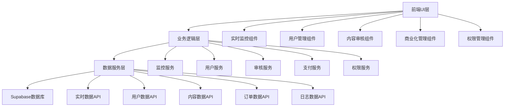

# Design Document - 星趣后台管理系统优化

## Overview

本设计文档详细描述了星趣后台管理系统的8大核心功能优化方案。基于现有的Next.js 14 + Supabase技术栈，通过新增和优化现有组件，构建一个高效、稳定、可扩展的运营管理平台。设计采用模块化架构，确保每个功能模块独立可维护，同时保持良好的集成性和一致的用户体验。

## Steering Document Alignment

### Technical Standards (tech.md)
由于项目暂无tech.md文档，设计将遵循以下技术标准：
- **TypeScript优先**：所有新增代码使用TypeScript
- **React函数组件**：使用hooks和函数式编程
- **Supabase最佳实践**：RLS安全策略、实时订阅、Edge Functions
- **响应式设计**：Tailwind CSS + 移动端适配
- **性能优化**：代码分割、懒加载、缓存策略

### Project Structure (structure.md)
遵循现有项目结构模式：
- `app/`：Next.js App Router页面
- `components/`：可复用React组件
- `lib/`：业务逻辑、服务、工具函数
- `hooks/`：自定义React Hooks
- `types/`：TypeScript类型定义

## Code Reuse Analysis

### Existing Components to Leverage
- **Card组件**：用于构建新的监控面板和管理界面
- **MetricCard**：扩展用于实时监控指标显示
- **AnalyticsChart**：复用于新的数据可视化需求
- **Button/Input/Badge**：UI基础组件复用
- **Navigation**：扩展导航菜单支持新功能模块
- **SkeletonLoader**：加载状态复用
- **Table组件**：用户管理、订单管理等数据表格

### Integration Points
- **Supabase数据库**：扩展现有表结构，新增监控、订单、权限相关表
- **认证系统**：基于现有AuthProvider扩展角色权限管理
- **dataService**：扩展现有服务支持新的数据查询需求
- **实时订阅**：利用Supabase Realtime构建实时监控

## Architecture

系统采用分层模块化架构，确保功能模块间的独立性和可维护性：

### Modular Design Principles
- **单一职责原则**：每个组件专注于一个业务领域
- **组件隔离**：新功能模块独立开发，避免影响现有功能
- **服务层分离**：数据访问、业务逻辑、UI呈现分层
- **工具模块化**：通用工具函数集中管理



## Components and Interfaces

### 1. 实时监控组件 (RealtimeMonitor)
- **Purpose:** 实时监控系统指标，异常告警
- **Interfaces:** 
  - `updateMetric(metricId: string, value: number)`: 更新指标值
  - `createAlert(alert: SystemAlert)`: 创建系统告警
  - `acknowledgeAlert(alertId: string)`: 确认告警
- **Dependencies:** supabase实时订阅、dataService
- **Reuses:** Card、Badge、实时订阅机制

### 2. 批量用户管理组件 (BatchUserManager)
- **Purpose:** 批量处理用户操作，标签管理
- **Interfaces:**
  - `selectUsers(userIds: string[])`: 选择用户
  - `batchOperation(operation: string, userIds: string[])`: 批量操作
  - `exportUsers(filters: UserFilter)`: 导出用户数据
- **Dependencies:** 现有userService、dataService
- **Reuses:** Table组件、Button组件、现有用户数据结构

### 3. AI内容审核组件 (AIContentModeration)
- **Purpose:** AI自动审核，人工复审管理
- **Interfaces:**
  - `reviewContent(contentId: string)`: 审核内容
  - `updateRules(rules: ModerationRule[])`: 更新审核规则
  - `handleAppeal(appealId: string)`: 处理申诉
- **Dependencies:** AI审核服务、contentService
- **Reuses:** Card组件、Badge状态显示、表格组件

### 4. 会员订阅管理组件 (SubscriptionManager)
- **Purpose:** 管理订阅计划、会员权益
- **Interfaces:**
  - `createPlan(plan: SubscriptionPlan)`: 创建订阅计划
  - `updateMemberBenefits(benefits: MemberBenefits)`: 更新会员权益
  - `batchUpgrade(userIds: string[], planId: string)`: 批量升级
- **Dependencies:** 支付服务、用户服务
- **Reuses:** Card组件、MetricCard展示统计

### 5. 订单支付管理组件 (OrderPaymentManager)
- **Purpose:** 订单查询、异常处理、财务报表
- **Interfaces:**
  - `queryOrders(filters: OrderFilter)`: 订单查询
  - `handleRefund(orderId: string, reason: string)`: 处理退款
  - `generateReport(dateRange: DateRange)`: 生成财务报表
- **Dependencies:** 支付API、数据服务
- **Reuses:** Table组件、AnalyticsChart图表展示

### 6. AI服务监控组件 (AIServiceMonitor)
- **Purpose:** 监控火山引擎API使用情况
- **Interfaces:**
  - `trackUsage(apiCall: AIApiCall)`: 追踪API调用
  - `analyzeCost(period: string)`: 分析费用
  - `optimizeSuggestions()`: 优化建议
- **Dependencies:** AI服务API、监控服务
- **Reuses:** MetricCard、AnalyticsChart

### 7. 权限管理组件 (PermissionManager)
- **Purpose:** 角色权限管理、操作审计
- **Interfaces:**
  - `createRole(role: AdminRole)`: 创建角色
  - `assignPermissions(roleId: string, permissions: Permission[])`: 分配权限
  - `auditLogs(filters: AuditFilter)`: 查询操作日志
- **Dependencies:** 认证服务、日志服务
- **Reuses:** 现有AuthProvider、Table组件

### 8. 系统配置组件 (SystemConfig)
- **Purpose:** 系统参数配置、A/B测试管理
- **Interfaces:**
  - `updateConfig(key: string, value: any)`: 更新配置
  - `createABTest(test: ABTest)`: 创建A/B测试
  - `toggleFeature(featureId: string)`: 功能开关
- **Dependencies:** 配置服务、实验服务
- **Reuses:** Card组件、Input组件

## Data Models

### 监控指标模型 (RealtimeMetric)
```typescript
interface RealtimeMetric {
  id: string
  name: string
  value: number | string
  unit?: string
  status: 'normal' | 'warning' | 'critical' | 'info'
  trend?: 'up' | 'down' | 'stable'
  threshold?: {
    warning: number
    critical: number
  }
  lastUpdated: Date
}
```

### 系统告警模型 (SystemAlert)
```typescript
interface SystemAlert {
  id: string
  type: 'warning' | 'error' | 'info' | 'success'
  title: string
  message: string
  metric?: string
  value?: number
  threshold?: number
  timestamp: Date
  acknowledged: boolean
}
```

### 会员订阅模型 (SubscriptionPlan)
```typescript
interface SubscriptionPlan {
  id: string
  name: string
  price: number
  duration: number // 天数
  features: string[]
  isActive: boolean
  createdAt: Date
  updatedAt: Date
}
```

### 支付订单模型 (PaymentOrder)
```typescript
interface PaymentOrder {
  id: string
  userId: string
  planId: string
  amount: number
  status: 'pending' | 'completed' | 'failed' | 'refunded'
  paymentMethod: string
  transactionId?: string
  createdAt: Date
  completedAt?: Date
}
```

### AI审核记录模型 (ModerationRecord)
```typescript
interface ModerationRecord {
  id: string
  contentId: string
  contentType: 'text' | 'image' | 'audio'
  result: 'approved' | 'rejected' | 'pending'
  confidence: number
  reasons: string[]
  reviewerId?: string
  createdAt: Date
  reviewedAt?: Date
}
```

### 管理员权限模型 (AdminPermission)
```typescript
interface AdminPermission {
  id: string
  adminId: string
  role: 'super_admin' | 'operator' | 'moderator' | 'technical'
  permissions: string[]
  createdAt: Date
  updatedAt: Date
}
```

### 操作日志模型 (AdminLog)
```typescript
interface AdminLog {
  id: string
  adminId: string
  action: string
  resource: string
  resourceId?: string
  details: Record<string, any>
  ipAddress: string
  userAgent: string
  createdAt: Date
}
```

### 系统配置模型 (SystemConfig)
```typescript
interface SystemConfig {
  id: string
  category: string
  key: string
  value: any
  description: string
  isActive: boolean
  updatedBy: string
  createdAt: Date
  updatedAt: Date
}
```

## Error Handling

### Error Scenarios
1. **实时数据连接失败**
   - **Handling:** 自动重连机制，显示离线状态，使用缓存数据
   - **User Impact:** 显示"连接中断"状态，功能降级但不中断

2. **批量操作部分失败**
   - **Handling:** 记录成功/失败项目，提供重试选项
   - **User Impact:** 详细的操作结果报告，失败项目可单独处理

3. **AI审核服务异常**
   - **Handling:** 降级为人工审核，记录异常日志
   - **User Impact:** 自动转入人工审核队列，不影响内容流程

4. **支付接口超时**
   - **Handling:** 订单状态查询确认，避免重复扣费
   - **User Impact:** 显示处理中状态，后台异步确认结果

5. **权限验证失败**
   - **Handling:** 立即停止操作，记录安全日志，通知管理员
   - **User Impact:** 显示权限不足提示，引导联系管理员

6. **数据导出超时**
   - **Handling:** 异步生成，邮件/站内信通知完成
   - **User Impact:** 显示正在生成，完成后主动通知

## Testing Strategy

### Unit Testing
- **组件测试**：每个新增组件的渲染、交互、状态管理
- **服务测试**：数据服务层的CRUD操作、错误处理
- **工具函数测试**：数据处理、格式化、验证函数
- **Hook测试**：自定义Hook的状态管理和副作用

### Integration Testing
- **API集成测试**：Supabase数据库操作、实时订阅
- **认证流程测试**：权限验证、角色切换
- **支付流程测试**：订单创建、支付确认、状态同步
- **审核流程测试**：内容提交、AI审核、人工复审

### End-to-End Testing
- **用户管理流程**：搜索→选择→批量操作→结果确认
- **内容审核流程**：内容提交→AI审核→人工复审→结果处理
- **订阅购买流程**：选择计划→支付→权益生效→续费提醒
- **监控告警流程**：指标异常→告警触发→处理确认→记录归档
- **权限管理流程**：角色创建→权限分配→访问验证→日志记录

### Performance Testing
- **大数据量测试**：10万用户数据的查询、导出性能
- **并发测试**：50个管理员同时操作的系统响应
- **实时性测试**：监控数据5秒刷新的准确性和稳定性
- **缓存测试**：数据缓存的命中率和失效策略

### Security Testing
- **权限边界测试**：角色权限的边界和越权访问防护
- **数据脱敏测试**：敏感数据在前端的脱敏处理
- **注入攻击测试**：SQL注入、XSS攻击的防护
- **会话安全测试**：会话超时、多设备登录限制

## Database Schema Extensions

### 监控相关表
```sql
-- 系统监控指标表
CREATE TABLE admin_metrics (
  id UUID PRIMARY KEY DEFAULT uuid_generate_v4(),
  metric_name VARCHAR(100) NOT NULL,
  metric_value NUMERIC NOT NULL,
  tags JSONB DEFAULT '{}',
  timestamp TIMESTAMP DEFAULT NOW(),
  INDEX (metric_name, timestamp)
);

-- 系统告警表
CREATE TABLE admin_alerts (
  id UUID PRIMARY KEY DEFAULT uuid_generate_v4(),
  alert_type VARCHAR(50) NOT NULL,
  title VARCHAR(200) NOT NULL,
  message TEXT NOT NULL,
  metric_name VARCHAR(100),
  threshold_value NUMERIC,
  current_value NUMERIC,
  status VARCHAR(20) DEFAULT 'active',
  acknowledged_by UUID REFERENCES admin_users(id),
  acknowledged_at TIMESTAMP,
  created_at TIMESTAMP DEFAULT NOW()
);
```

### 商业化相关表
```sql
-- 订阅计划表
CREATE TABLE subscription_plans (
  id UUID PRIMARY KEY DEFAULT uuid_generate_v4(),
  name VARCHAR(100) NOT NULL,
  price DECIMAL(10,2) NOT NULL,
  duration_days INTEGER NOT NULL,
  features JSONB NOT NULL,
  is_active BOOLEAN DEFAULT TRUE,
  created_at TIMESTAMP DEFAULT NOW(),
  updated_at TIMESTAMP DEFAULT NOW()
);

-- 用户订阅表
CREATE TABLE user_subscriptions (
  id UUID PRIMARY KEY DEFAULT uuid_generate_v4(),
  user_id UUID NOT NULL,
  plan_id UUID REFERENCES subscription_plans(id),
  status VARCHAR(20) NOT NULL,
  started_at TIMESTAMP NOT NULL,
  expires_at TIMESTAMP NOT NULL,
  auto_renew BOOLEAN DEFAULT FALSE,
  created_at TIMESTAMP DEFAULT NOW(),
  updated_at TIMESTAMP DEFAULT NOW()
);

-- 支付订单表
CREATE TABLE payment_orders (
  id UUID PRIMARY KEY DEFAULT uuid_generate_v4(),
  user_id UUID NOT NULL,
  plan_id UUID REFERENCES subscription_plans(id),
  amount DECIMAL(10,2) NOT NULL,
  status VARCHAR(20) NOT NULL,
  payment_method VARCHAR(50),
  transaction_id VARCHAR(200),
  created_at TIMESTAMP DEFAULT NOW(),
  completed_at TIMESTAMP,
  refunded_at TIMESTAMP
);
```

### 权限管理相关表
```sql
-- 管理员用户表（扩展现有）
ALTER TABLE admin_users ADD COLUMN IF NOT EXISTS role VARCHAR(50) NOT NULL DEFAULT 'operator';
ALTER TABLE admin_users ADD COLUMN IF NOT EXISTS permissions JSONB DEFAULT '{}';
ALTER TABLE admin_users ADD COLUMN IF NOT EXISTS last_login_at TIMESTAMP;

-- 操作日志表
CREATE TABLE admin_operation_logs (
  id UUID PRIMARY KEY DEFAULT uuid_generate_v4(),
  admin_id UUID REFERENCES admin_users(id),
  action VARCHAR(100) NOT NULL,
  resource VARCHAR(100),
  resource_id VARCHAR(100),
  details JSONB,
  ip_address INET,
  user_agent TEXT,
  created_at TIMESTAMP DEFAULT NOW()
);
```

### 内容审核相关表
```sql
-- 审核记录表
CREATE TABLE content_moderation_records (
  id UUID PRIMARY KEY DEFAULT uuid_generate_v4(),
  content_id VARCHAR(200) NOT NULL,
  content_type VARCHAR(20) NOT NULL,
  result VARCHAR(20) NOT NULL,
  confidence DECIMAL(3,2),
  reasons JSONB,
  reviewer_id UUID REFERENCES admin_users(id),
  created_at TIMESTAMP DEFAULT NOW(),
  reviewed_at TIMESTAMP
);

-- 用户举报表
CREATE TABLE user_reports (
  id UUID PRIMARY KEY DEFAULT uuid_generate_v4(),
  reporter_id UUID,
  reported_content_id VARCHAR(200),
  reported_user_id UUID,
  report_type VARCHAR(50) NOT NULL,
  reason TEXT NOT NULL,
  status VARCHAR(20) DEFAULT 'pending',
  handled_by UUID REFERENCES admin_users(id),
  handled_at TIMESTAMP,
  created_at TIMESTAMP DEFAULT NOW()
);
```

### 系统配置相关表
```sql
-- 系统配置表
CREATE TABLE system_configurations (
  id UUID PRIMARY KEY DEFAULT uuid_generate_v4(),
  category VARCHAR(100) NOT NULL,
  config_key VARCHAR(200) NOT NULL,
  config_value JSONB NOT NULL,
  description TEXT,
  is_active BOOLEAN DEFAULT TRUE,
  updated_by UUID REFERENCES admin_users(id),
  created_at TIMESTAMP DEFAULT NOW(),
  updated_at TIMESTAMP DEFAULT NOW(),
  UNIQUE(category, config_key)
);

-- A/B测试配置表
CREATE TABLE ab_test_configs (
  id UUID PRIMARY KEY DEFAULT uuid_generate_v4(),
  name VARCHAR(200) NOT NULL,
  description TEXT,
  variants JSONB NOT NULL,
  traffic_split JSONB NOT NULL,
  status VARCHAR(20) DEFAULT 'draft',
  started_at TIMESTAMP,
  ended_at TIMESTAMP,
  created_by UUID REFERENCES admin_users(id),
  created_at TIMESTAMP DEFAULT NOW()
);
```

## Implementation Sequence

### Phase 1: 基础设施（第1-2周）
1. 数据库表结构创建和迁移
2. 基础服务层扩展（dataService、authService）
3. 权限管理系统基础框架
4. 实时监控基础组件

### Phase 2: 核心功能（第3-5周）
1. 实时监控与告警系统完整实现
2. 批量用户管理功能
3. AI内容审核系统
4. 会员订阅管理基础功能

### Phase 3: 商业化功能（第6-7周）
1. 订单支付管理系统
2. AI服务监控功能
3. 商业化数据分析增强

### Phase 4: 高级功能（第8-9周）
1. 系统配置中心
2. A/B测试管理
3. 高级权限管理功能
4. 性能优化和安全加固

### Phase 5: 测试和优化（第10周）
1. 全面测试（单元、集成、E2E）
2. 性能优化
3. 用户体验优化
4. 文档完善和部署准备