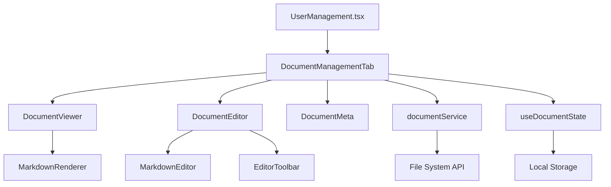

# Design Document

## Overview

隐私/用户协议管理功能是对现有用户管理页面的扩展，通过添加新的标签页实现对docs文件夹中法律文档的在线管理。该功能采用模块化设计，集成现有UI组件库，提供文档查看、编辑、保存的完整工作流程，同时保持与现有系统架构的一致性。

## Steering Document Alignment

### Technical Standards (tech.md)
- 遵循React + TypeScript技术栈
- 使用现有的Radix UI组件系统
- 保持代码分层架构（组件层、服务层、类型层）
- 采用函数式组件和React Hooks模式

### Project Structure (structure.md)
- 在`src/components`中创建文档管理相关组件
- 在`src/services`中扩展文件操作服务
- 在`src/types`中定义文档管理类型
- 在`src/hooks`中实现文档状态管理钩子

## Code Reuse Analysis

### Existing Components to Leverage
- **Tabs组件**: 将现有用户管理页面的2个标签扩展为3个标签（基础属性、账户状态、隐私协议管理）
- **Card组件**: 用于文档显示区域的容器布局
- **Button组件**: 编辑、保存、取消等操作按钮
- **Alert/Toast组件**: 操作成功/失败的反馈提示

### Integration Points
- **UserManagement.tsx**: 在现有标签系统中添加新的"隐私协议管理"标签
- **文件系统操作**: 通过Node.js/Electron API实现对docs/用户协议.md的读写操作
- **状态管理**: 利用现有的useState和useEffect模式管理文档状态

## Architecture

采用分层架构设计，将文档管理功能作为用户管理模块的子功能实现，确保代码的可维护性和可扩展性。

### Modular Design Principles
- **单文件职责**: DocumentEditor组件专注于编辑功能，DocumentViewer专注于显示
- **组件隔离**: 文档操作组件与用户管理组件解耦，可独立测试和复用
- **服务层分离**: 文件操作逻辑封装在独立的documentService中
- **工具模块化**: Markdown解析、文件验证等功能分离为独立工具函数



## Components and Interfaces

### DocumentManagementTab
- **Purpose:** 文档管理的主容器组件，协调子组件交互
- **Interfaces:** 
  - `currentDocument: string` - 当前文档路径
  - `onDocumentChange: (doc: string) => void` - 文档切换回调
- **Dependencies:** documentService, useDocumentState
- **Reuses:** Card, Button, Alert组件

### DocumentViewer
- **Purpose:** 只读模式下的文档显示组件
- **Interfaces:**
  - `content: string` - Markdown内容
  - `metadata: DocumentMetadata` - 文档元数据
  - `onEdit: () => void` - 进入编辑模式回调
- **Dependencies:** MarkdownRenderer
- **Reuses:** Card, CardHeader, CardContent组件

### DocumentEditor
- **Purpose:** 可编辑模式下的文档编辑器组件
- **Interfaces:**
  - `content: string` - 当前内容
  - `onChange: (content: string) => void` - 内容变更回调
  - `onSave: (content: string) => Promise<void>` - 保存回调
  - `onCancel: () => void` - 取消编辑回调
- **Dependencies:** MarkdownEditor, EditorToolbar
- **Reuses:** Card, Button组件

### MarkdownEditor
- **Purpose:** 支持Markdown语法的文本编辑器
- **Interfaces:**
  - `value: string` - 当前值
  - `onChange: (value: string) => void` - 变更回调
  - `placeholder?: string` - 占位符文本
- **Dependencies:** 无（原生textarea + 语法高亮）
- **Reuses:** 现有CSS变量系统

## Data Models

### DocumentMetadata
```typescript
interface DocumentMetadata {
  fileName: string           // 文件名
  filePath: string          // 完整文件路径
  fileSize: number          // 文件大小（字节）
  lastModified: Date        // 最后修改时间
  createdAt: Date          // 创建时间
  documentType: DocumentType // 文档类型
}
```

### DocumentType
```typescript
type DocumentType = 'user-agreement' | 'privacy-policy' | 'service-terms' | 'other'
```

### DocumentState
```typescript
interface DocumentState {
  content: string           // 当前内容
  originalContent: string   // 原始内容（用于检测是否有修改）
  isEditing: boolean       // 是否处于编辑状态
  isDirty: boolean         // 是否有未保存的修改
  isLoading: boolean       // 是否正在加载
  error: string | null     // 错误信息
  metadata: DocumentMetadata | null // 文档元数据
}
```

### DocumentService
```typescript
interface DocumentService {
  loadDocument(filePath: string): Promise<DocumentState>
  saveDocument(filePath: string, content: string): Promise<void>
  getDocumentMetadata(filePath: string): Promise<DocumentMetadata>
  validateMarkdown(content: string): ValidationResult
  updateDocumentDate(content: string): string  // 自动更新文档中的日期
}
```

## Error Handling

### Error Scenarios
1. **文件读取失败**
   - **Handling:** 显示错误消息，提供重试按钮
   - **User Impact:** 用户看到"文档加载失败，请重试"提示

2. **文件保存失败**
   - **Handling:** 保持编辑状态，显示错误信息，自动保存草稿到localStorage
   - **User Impact:** 用户看到保存失败提示，内容不会丢失

3. **文档解析错误**
   - **Handling:** 显示语法错误提示，高亮错误行
   - **User Impact:** 用户看到具体的Markdown语法错误位置

4. **并发编辑冲突**
   - **Handling:** 检测文件修改时间，提示用户选择保留哪个版本
   - **User Impact:** 用户看到冲突解决对话框

5. **网络/权限错误**
   - **Handling:** 显示具体错误原因，提供相应解决建议
   - **User Impact:** 用户看到权限不足或系统错误提示

## Testing Strategy

### Unit Testing
- **组件测试**: 使用React Testing Library测试各个组件的渲染和交互
- **服务测试**: 模拟文件系统操作，测试documentService的各个方法
- **工具函数测试**: 测试Markdown解析、日期更新等工具函数

### Integration Testing
- **文档流程测试**: 测试从查看 → 编辑 → 保存的完整流程
- **标签集成测试**: 测试新标签与现有用户管理标签的交互
- **错误恢复测试**: 测试各种错误场景下的用户体验

### End-to-End Testing
- **完整用户场景**: 模拟管理员登录、导航到用户管理、编辑文档、保存文档的完整流程
- **多文档管理**: 测试在支持多种文档类型时的切换和管理功能
- **响应式测试**: 验证在不同屏幕尺寸下的用户体验