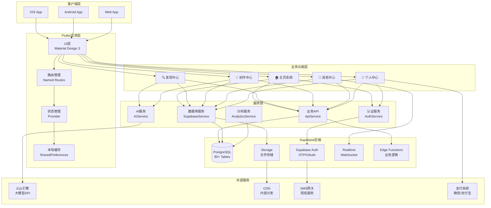
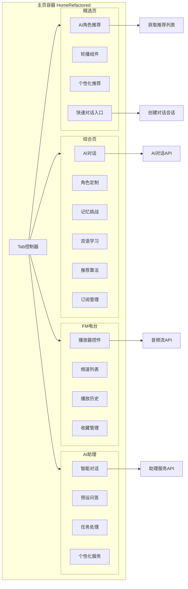
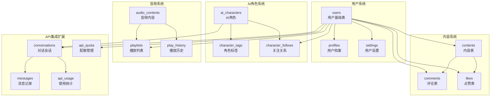
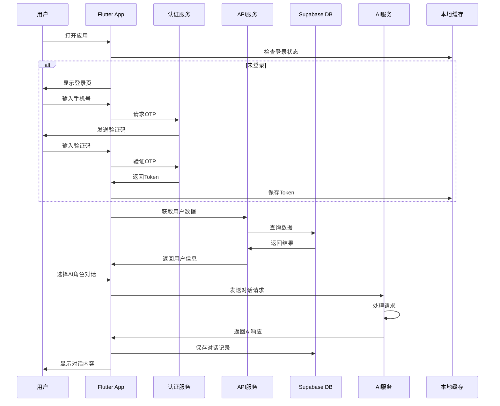
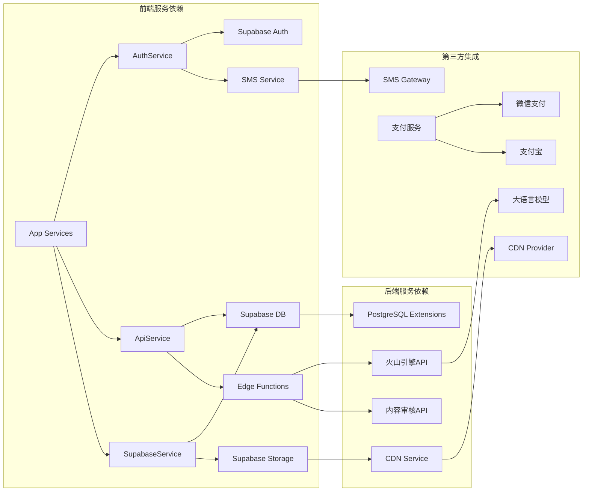
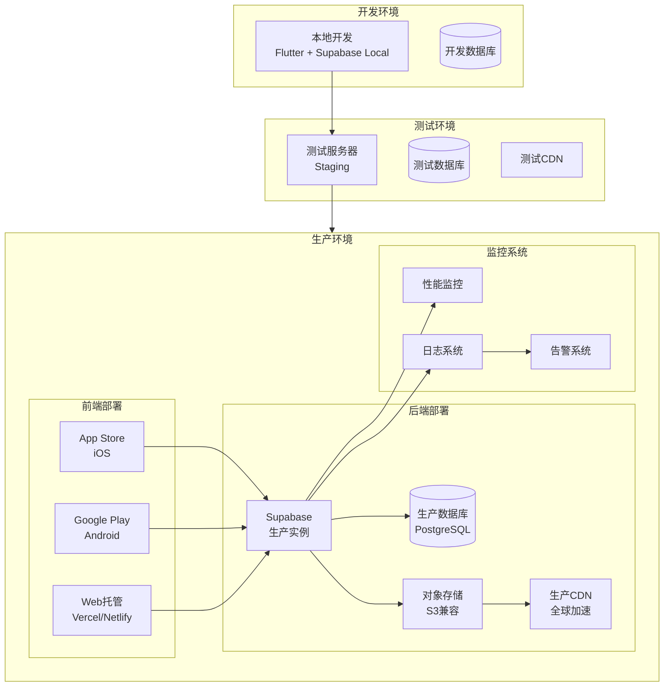
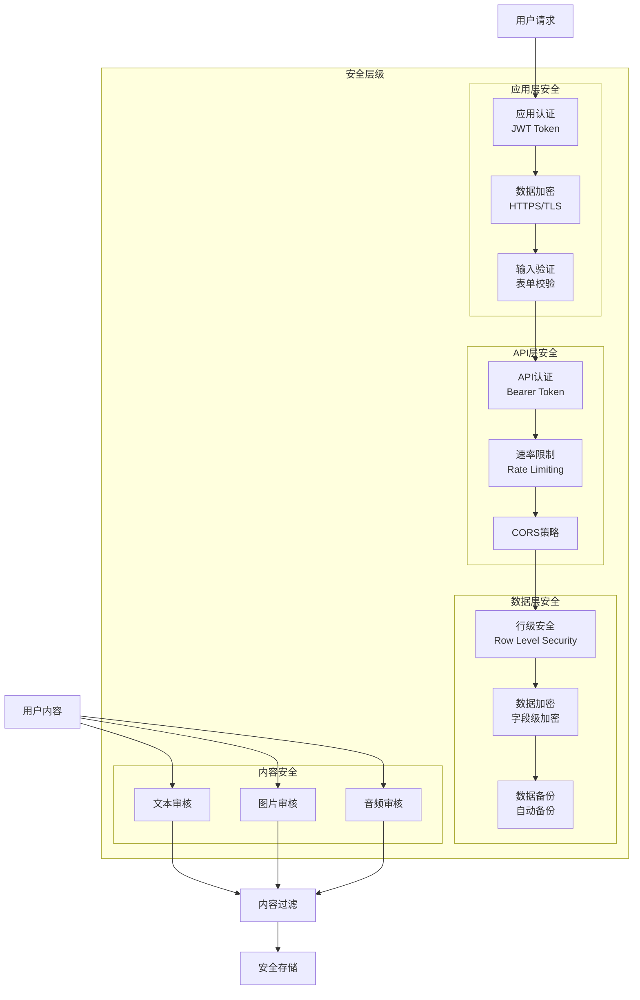
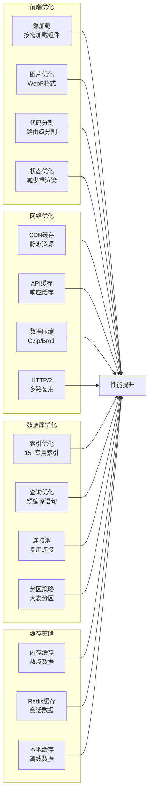

# 星趣App架构图集

## 1. 系统整体架构图

## 2. 主页功能架构图

## 3. 数据库架构图

## 4. 数据流架构图

## 5. 服务依赖关系图

## 6. 部署架构图

## 7. 安全架构图

## 8. 性能优化架构图

## 说明

这些架构图展示了星趣App的完整技术架构：

1. **系统整体架构** - 展示了从客户端到后端的完整技术栈
2. **主页功能架构** - 详细展示了4个Tab页面的功能结构
3. **数据库架构** - 展示了80+表的关系结构
4. **数据流架构** - 展示了用户操作的完整数据流程
5. **服务依赖关系** - 展示了各服务之间的依赖关系
6. **部署架构** - 展示了开发、测试、生产环境的部署结构
7. **安全架构** - 展示了多层级的安全防护体系
8. **性能优化架构** - 展示了全方位的性能优化策略

所有图表均使用Mermaid语法，可以在支持Mermaid的Markdown查看器中直接渲染查看。