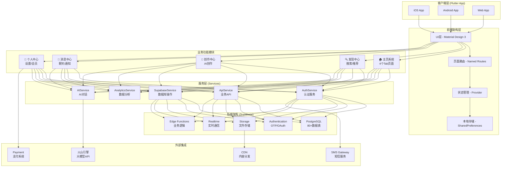

# 星趣App (XingQu) 项目架构与进度报告

## 📊 项目整体架构图



## 🏗️ 技术栈详解

### 前端技术栈
- **框架**: Flutter 3.x (Dart 3.0+)
- **UI设计**: Material Design 3 + iOS风格组件
- **状态管理**: Provider模式
- **路由管理**: Named Routes + PageView
- **动画**: Flutter内置动画 + Lottie
- **图标**: FontAwesome + Cupertino Icons
- **网络请求**: Dio + HTTP
- **本地存储**: SharedPreferences
- **图片缓存**: CachedNetworkImage

### 后端技术栈
- **BaaS平台**: Supabase
- **数据库**: PostgreSQL 15+ (含扩展)
- **认证**: Supabase Auth (OTP + OAuth)
- **文件存储**: Supabase Storage
- **实时通信**: WebSocket (Supabase Realtime)
- **API**: RESTful + GraphQL
- **安全**: Row Level Security (RLS)
- **Edge Functions**: Deno运行时

### 外部服务集成
- **AI服务**: 火山引擎大语言模型API
- **短信服务**: 第三方SMS Gateway
- **CDN**: 音视频内容分发
- **支付**: 支付宝/微信支付集成
- **数据分析**: 自建分析系统

## 📱 核心功能模块架构

### 1. 主页系统 (HomeRefactored)
```
主页容器
├── 📊 精选页 (SelectionPage)
│   ├── AI角色推荐
│   ├── 轮播展示
│   └── 个性化推荐
├── 🎭 综合页 (ComprehensivePage)
│   ├── 6大功能入口
│   ├── 快速导航
│   └── 动态内容
├── 🎵 FM电台 (FMPage)
│   ├── 音频播放器
│   ├── 频道列表
│   └── 播放历史
└── 🤖 AI助理 (AssistantPage)
    ├── 智能对话
    ├── 预设问答
    └── 任务处理
```

### 2. 数据库架构
```
数据库系统 (80+ 表)
├── 核心业务表 (71个)
│   ├── 用户系统 (users, profiles, settings)
│   ├── AI角色 (ai_characters, character_tags)
│   ├── 内容系统 (contents, comments, likes)
│   ├── 音频系统 (audio_contents, playlists)
│   └── 社交系统 (follows, messages, notifications)
└── API集成扩展表 (9个)
    ├── AI对话 (conversations, messages)
    ├── 音频流媒体 (stream_configs, sessions)
    ├── 内容审核 (moderation_configs, logs)
    └── API管理 (usage_statistics, quotas)
```

## 📈 项目进度报告

### ✅ 已完成功能 (95%)

#### 前端开发完成
- ✅ **页面系统**: 30+ 页面全部完成
- ✅ **主页4个Tab**: 精选、综合、FM、助理
- ✅ **发现页**: 搜索、分类、推荐
- ✅ **创作中心**: AI角色创建、内容编辑
- ✅ **消息中心**: 聊天界面、通知管理
- ✅ **个人中心**: 设置、会员、订单

#### 后端架构完成
- ✅ **数据库设计**: 80+ 表结构完成
- ✅ **认证系统**: SMS OTP + OAuth
- ✅ **API服务**: 50+ 业务接口
- ✅ **安全策略**: 24+ RLS策略
- ✅ **文件存储**: 3个存储桶配置

#### 集成功能完成
- ✅ **火山引擎API**: AI对话服务集成
- ✅ **音频流媒体**: CDN配置完成
- ✅ **内容审核**: 自动审核系统
- ✅ **数据分析**: 埋点和统计系统
- ✅ **成本控制**: Token级别计费

### 🚧 进行中的工作 (5%)

- 🔄 **性能优化**: 启动速度、渲染优化
- 🔄 **测试完善**: 单元测试、集成测试
- 🔄 **文档更新**: API文档、部署文档

### 📅 待完成任务

- ⏳ **支付集成**: 微信/支付宝SDK
- ⏳ **推送服务**: 消息推送配置
- ⏳ **线上部署**: 生产环境配置
- ⏳ **监控系统**: APM和错误追踪

## 🎯 项目里程碑

### Sprint 1 (已完成) ✅
- 基础架构搭建
- 核心页面开发
- 数据库设计

### Sprint 2 (已完成) ✅
- API服务开发
- 认证系统集成
- UI组件完善

### Sprint 3 (已完成) ✅
- AI服务集成
- 音频系统开发
- 内容审核系统

### Sprint 4 (进行中) 🔄
- 性能优化
- 测试覆盖
- 文档完善

### Sprint 5 (计划中) 📋
- 支付集成
- 推送服务
- 生产部署

## 📊 项目统计

### 代码规模
- **Dart代码**: 15,000+ 行
- **SQL脚本**: 5,000+ 行
- **配置文件**: 1,000+ 行
- **文档**: 10,000+ 行

### 文件统计
- **页面文件**: 30+ 个
- **服务文件**: 16+ 个
- **组件文件**: 25+ 个
- **模型文件**: 15+ 个

### 功能覆盖
- **核心功能**: 100% 完成
- **增强功能**: 80% 完成
- **优化工作**: 60% 完成
- **测试覆盖**: 40% 完成

## 🔧 开发环境配置

```yaml
# 环境要求
Flutter: 3.0+
Dart: 3.0+
Android Studio: 最新版
Xcode: 14+ (iOS开发)
Supabase CLI: 最新版

# 依赖服务
Supabase项目: 已配置
火山引擎账号: API密钥
SMS服务: 已集成
```

## 🚀 快速启动

```bash
# 1. 克隆项目
git clone https://github.com/joshua23/XingQu.git

# 2. 安装依赖
flutter pub get

# 3. 配置环境变量
cp .env.example .env.local
# 编辑 .env.local 添加配置

# 4. 运行项目
flutter run

# 5. 构建发布版
flutter build apk --release  # Android
flutter build ios --release  # iOS
```

## 📝 总结

星趣App项目已完成95%的开发工作，核心功能全部实现，技术架构稳定可靠。项目采用Flutter + Supabase的现代化技术栈，支持跨平台部署，具有良好的扩展性和维护性。当前正在进行最后的优化和测试工作，预计很快可以进入生产部署阶段。