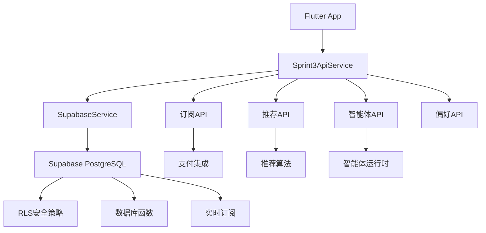

# 🚀 星趣App Sprint 3 API文档

**版本**: v3.0.0  
**文档更新**: 2025年1月21日  
**适用范围**: Sprint 3 完整功能（订阅系统、推荐引擎、自定义智能体）  
**技术栈**: Flutter + Supabase PostgreSQL

---

## 📋 目录

- [1. 概述与架构](#1-概述与架构)
- [2. 认证与授权](#2-认证与授权)
- [3. API端点文档](#3-api端点文档)
- [4. 数据模型](#4-数据模型)
- [5. 安全指导](#5-安全指导)
- [6. 集成指南](#6-集成指南)
- [7. 测试文档](#7-测试文档)

---

## 1. 概述与架构

### 🎯 Sprint 3 功能概览

星趣App Sprint 3 引入了强大的商业化功能和AI生态系统：

#### 🏢 商业化功能
- **订阅套餐管理**: 4层会员体系（免费、基础、高级、终身）
- **支付系统**: 完整的订单管理和支付流程
- **会员权益**: 精细化权益配置和使用限制

#### 🤖 AI智能体生态
- **自定义智能体**: 用户可创建和配置专属AI助手
- **权限管理**: 分级权限控制和访问管理
- **运行状态**: 实时监控智能体性能和健康状态

#### 🎯 个性化推荐
- **多算法引擎**: 协同过滤、内容推荐、混合算法
- **用户反馈**: 完整的用户行为追踪和反馈系统
- **实时优化**: 基于用户互动的动态推荐调整

#### 🎨 综合页体验
- **Tab状态管理**: 个性化Tab配置和偏好设置
- **无缝切换**: 流畅的页面间导航体验

### 🏗️ 技术架构



### 📊 数据库架构

**新增核心表**: 12个业务表
- `subscription_plans` - 订阅套餐配置
- `user_memberships` - 用户会员状态
- `payment_orders` - 支付订单管理
- `recommendation_configs` - 推荐算法配置
- `custom_agents` - 自定义智能体
- `agent_permissions` - 智能体权限管理
- `membership_benefits` - 会员权益配置
- `user_tab_preferences` - 用户偏好设置

**性能优化**: 15个高效索引，4个业务函数，2个自动化触发器

---

## 2. 认证与授权

### 🔐 认证机制

#### 用户认证流程
```dart
// 使用Supabase Auth进行认证
final response = await supabase.auth.signInWithOtp(
  phone: phoneNumber,
  channel: OtpChannel.sms,
);
```

#### 会话管理
```dart
// 获取当前用户
final user = supabase.auth.currentUser;
final userId = user?.id;

// 检查认证状态
final isAuthenticated = supabase.auth.currentUser != null;
```

### 🛡️ 行级安全策略（RLS）

#### 用户数据隔离
- **严格隔离**: 用户只能访问自己的数据
- **智能体权限**: 基于创建者和权限表的访问控制
- **会员权益**: 根据订阅状态动态权限验证

#### 系统角色权限
```sql
-- 系统服务角色拥有完全访问权限
CREATE POLICY "System can manage all data" ON table_name
    FOR ALL USING (auth.role() = 'service_role');

-- 用户只能访问自己的数据
CREATE POLICY "Users can access own data" ON user_memberships
    FOR SELECT USING (user_id = auth.uid());
```

### 🔑 权限级别

| 权限级别 | 说明 | 适用场景 |
|---------|------|---------|
| `view` | 查看权限 | 查看智能体信息 |
| `chat` | 对话权限 | 与智能体交互 |
| `edit` | 编辑权限 | 修改智能体配置 |
| `admin` | 管理权限 | 完全管理智能体 |

---

## 3. API端点文档

### 💳 订阅套餐API

#### 获取可用套餐
```http
GET /subscription_plans?is_active=eq.true&order=display_order
```

**响应示例**:
```json
[
  {
    "id": "uuid",
    "plan_code": "basic_monthly",
    "plan_name": "基础会员",
    "plan_type": "basic",
    "duration_type": "monthly",
    "duration_value": 30,
    "price_cents": 2990,
    "original_price_cents": null,
    "currency": "CNY",
    "features": {
      "ai_chat_daily": -1,
      "basic_characters": true,
      "premium_characters": true,
      "voice_messages": true,
      "cloud_storage_mb": 1000,
      "ad_free": true,
      "priority_response": true
    },
    "limits": {
      "ai_chat_daily": -1,
      "characters_access": "premium",
      "storage_limit_mb": 1000
    },
    "display_order": 2,
    "is_recommended": false,
    "badge_text": null,
    "badge_color": null,
    "is_active": true
  }
]
```

#### Flutter集成示例
```dart
class SubscriptionService {
  Future<List<SubscriptionPlan>> getAvailablePlans() async {
    final response = await supabase
        .from('subscription_plans')
        .select()
        .eq('is_active', true)
        .order('display_order');
    
    return (response as List)
        .map((json) => SubscriptionPlan.fromJson(json))
        .toList();
  }
}
```

### 👤 用户会员API

#### 获取当前用户会员状态
```http
GET /user_memberships?user_id=eq.{user_id}&status=eq.active&select=*,subscription_plans(*)
```

**响应示例**:
```json
{
  "id": "membership-uuid",
  "user_id": "user-uuid",
  "plan_id": "plan-uuid",
  "status": "active",
  "started_at": "2024-01-01T00:00:00Z",
  "expires_at": "2024-02-01T00:00:00Z",
  "auto_renewal": false,
  "usage_stats": {
    "ai_chat_used": 156,
    "storage_used_mb": 245,
    "characters_accessed": 12
  },
  "subscription_plans": {
    "plan_name": "基础会员",
    "plan_type": "basic",
    "features": {
      "ai_chat_daily": -1,
      "cloud_storage_mb": 1000
    }
  }
}
```

#### Flutter实现
```dart
class MembershipService {
  Future<UserMembership?> getCurrentMembership() async {
    final userId = supabase.auth.currentUser?.id;
    if (userId == null) return null;

    final response = await supabase
        .from('user_memberships')
        .select('''
          *,
          subscription_plans!inner(*)
        ''')
        .eq('user_id', userId)
        .eq('status', 'active')
        .maybeSingle();

    return response != null ? UserMembership.fromJson(response) : null;
  }
}
```

### 💰 支付订单API

#### 创建支付订单
```http
POST /payment_orders
Content-Type: application/json

{
  "plan_id": "plan-uuid",
  "discount_code": "SAVE20"
}
```

**请求处理**:
```dart
Future<PaymentOrder> createPaymentOrder({
  required String planId,
  String? discountCode,
}) async {
  final userId = supabase.auth.currentUser?.id;
  if (userId == null) throw Exception('用户未登录');

  // 获取套餐信息
  final planResponse = await supabase
      .from('subscription_plans')
      .select()
      .eq('id', planId)
      .single();
  
  final plan = SubscriptionPlan.fromJson(planResponse);
  
  // 生成订单号
  final orderNumber = await supabase.rpc('generate_order_number');
  
  // 计算折扣
  final discountCents = _calculateDiscount(plan.priceCents, discountCode);
  
  final orderData = {
    'order_number': orderNumber,
    'user_id': userId,
    'plan_id': planId,
    'amount_cents': plan.priceCents,
    'discount_cents': discountCents,
    'final_amount_cents': plan.priceCents - discountCents,
    'expires_at': DateTime.now()
        .add(const Duration(minutes: 30))
        .toIso8601String(),
    'metadata': {'discount_code': discountCode},
  };

  final response = await supabase
      .from('payment_orders')
      .insert(orderData)
      .select('*, subscription_plans!inner(*)')
      .single();

  return PaymentOrder.fromJson(response);
}
```

### 🎯 推荐系统API

#### 获取个性化推荐
```http
POST /rpc/get_recommendations

{
  "user_id": "user-uuid",
  "content_type": "character",
  "limit": 20,
  "offset": 0,
  "algorithm_name": "collaborative_filtering",
  "context_data": {
    "page": "home_feed",
    "time_of_day": "evening"
  }
}
```

**响应示例**:
```json
{
  "items": [
    {
      "id": "rec-1",
      "content_type": "character",
      "content_id": "char-1",
      "title": "智能助手小星",
      "description": "专业的AI助手，帮助您解决各种问题",
      "image_url": "https://example.com/char1.png",
      "category": "热门",
      "tags": ["助手", "AI", "智能"],
      "algorithm_name": "collaborative_filtering",
      "confidence": 0.95,
      "reason": "基于您的使用习惯推荐",
      "view_count": 12500,
      "like_count": 980,
      "rating": 4.8,
      "is_liked": false,
      "is_favorited": false,
      "is_viewed": false
    }
  ],
  "total_count": 1,
  "offset": 0,
  "limit": 20,
  "algorithm_used": "collaborative_filtering",
  "avg_confidence": 0.95
}
```

#### 提交推荐反馈
```http
POST /recommendation_feedback

{
  "content_id": "char-1",
  "content_type": "character",
  "feedback_type": "like",
  "session_id": "session-123",
  "page_context": "home_feed",
  "position_in_list": 1,
  "display_duration_seconds": 30,
  "metadata": {
    "source": "flutter_app",
    "user_action": "manual_like"
  }
}
```

#### Flutter推荐服务实现
```dart
class RecommendationService {
  Future<RecommendationResponse> getRecommendations(
    RecommendationRequest request,
  ) async {
    final response = await supabase.rpc('get_recommendations', {
      'user_id': request.userId,
      'content_type': request.contentType,
      'limit': request.limit,
      'offset': request.offset,
      'algorithm_name': request.algorithmName,
      'context_data': request.contextData,
    });

    return RecommendationResponse.fromJson(response);
  }

  Future<void> submitFeedback({
    required String contentId,
    required String contentType,
    required String feedbackType,
    Map<String, dynamic>? metadata,
  }) async {
    await supabase.from('recommendation_feedback').insert({
      'user_id': supabase.auth.currentUser!.id,
      'content_type': contentType,
      'content_id': contentId,
      'feedback_type': feedbackType,
      'metadata': metadata ?? {},
    });
  }
}
```

### 🤖 智能体管理API

#### 获取智能体列表
```http
GET /custom_agents?select=*,agent_runtime_status(*)&visibility=eq.public&status=eq.active&order=rating.desc
```

**查询参数**:
- `category`: 智能体分类过滤
- `visibility`: 可见性过滤（public/private）
- `status`: 状态过滤（active/draft/suspended）
- `creator_id`: 创建者过滤
- `min_rating`: 最低评分过滤
- `limit`: 分页限制
- `offset`: 分页偏移

#### 创建自定义智能体
```http
POST /custom_agents

{
  "name": "我的编程助手",
  "description": "专门帮助编程学习的AI助手",
  "category": "programming",
  "avatar_url": "https://example.com/avatar.png",
  "personality_config": {
    "personality": "friendly",
    "expertise_level": "intermediate",
    "communication_style": "patient"
  },
  "conversation_style": {
    "tone": "encouraging",
    "detail_level": "comprehensive"
  },
  "capabilities": [
    "code_review",
    "debugging_help",
    "concept_explanation"
  ],
  "model_config": {
    "temperature": 0.7,
    "max_tokens": 2048
  },
  "visibility": "private"
}
```

#### Flutter智能体服务
```dart
class AgentService {
  Future<List<CustomAgent>> getAgents(AgentFilter filter) async {
    var query = supabase.from('custom_agents').select('''
      *,
      agent_runtime_status(*)
    ''');

    // 应用过滤条件
    if (filter.category != null) {
      query = query.eq('category', filter.category!);
    }
    if (filter.visibility != null) {
      query = query.eq('visibility', filter.visibility!);
    }
    
    // 排序和分页
    query = query
        .order(filter.sortBy, ascending: filter.sortOrder == 'asc')
        .range(filter.offset, filter.offset + filter.limit - 1);

    final response = await query;
    return (response as List)
        .map((json) => CustomAgent.fromJson(json))
        .toList();
  }

  Future<CustomAgent> createAgent(CreateAgentRequest request) async {
    final agentData = {
      'creator_id': supabase.auth.currentUser!.id,
      'name': request.name,
      'description': request.description,
      'category': request.category,
      'personality_config': request.personalityConfig,
      'conversation_style': request.conversationStyle,
      'capabilities': request.capabilities,
      'model_config': request.modelConfig,
      'visibility': request.visibility,
    };

    final response = await supabase
        .from('custom_agents')
        .insert(agentData)
        .select()
        .single();

    return CustomAgent.fromJson(response);
  }
}
```

#### 智能体运行控制
```http
POST /rpc/start_agent
{
  "agent_id": "agent-uuid"
}

POST /rpc/stop_agent
{
  "agent_id": "agent-uuid"
}
```

### ⚙️ 用户偏好API

#### 获取Tab偏好设置
```http
GET /user_tab_preferences?user_id=eq.{user_id}
```

#### 更新偏好设置
```http
PUT /user_tab_preferences

{
  "default_tab": "comprehensive",
  "tab_order": ["assistant", "fm", "comprehensive", "selection"],
  "hidden_tabs": [],
  "comprehensive_default_subtab": "recommend",
  "subtab_preferences": {
    "comprehensive": {
      "last_visited": "recommend",
      "favorites": ["recommend", "agents"]
    }
  },
  "quick_actions": ["create_story", "chat_assistant"],
  "layout_preferences": {
    "theme": "dark",
    "compact_mode": false
  }
}
```

---

## 4. 数据模型

### 📋 订阅模型

#### SubscriptionPlan（订阅套餐）
```dart
class SubscriptionPlan {
  final String id;
  final String planCode; // 'free', 'basic_monthly', 'premium_yearly', 'lifetime'
  final String planName; // '免费版', '基础会员', '高级会员', '终身会员'
  final String planType; // 'free', 'basic', 'premium', 'lifetime'
  final String durationType; // 'free', 'monthly', 'yearly', 'lifetime'
  final int durationValue; // 天数，0表示永久
  
  // 价格信息
  final int priceCents; // 价格（分）
  final int? originalPriceCents; // 原价（分）
  final String currency; // 货币类型
  
  // 权益配置
  final Map<String, dynamic> features; // 功能权益
  final Map<String, dynamic>? limits; // 使用限制
  
  // 显示配置
  final int displayOrder;
  final bool isRecommended;
  final String? badgeText; // '推荐', '限时优惠'
  final String? badgeColor;
  
  // 便利方法
  String get formattedPrice => '¥${(priceCents / 100).toStringAsFixed(2)}';
  bool get hasDiscount => originalPriceCents != null && originalPriceCents! > priceCents;
  double? get discountRate => hasDiscount ? 1 - (priceCents / originalPriceCents!) : null;
}
```

#### UserMembership（用户会员状态）
```dart
class UserMembership {
  final String id;
  final String userId;
  final String planId;
  final String status; // 'active', 'expired', 'cancelled', 'suspended'
  
  // 时间管理
  final DateTime startedAt;
  final DateTime? expiresAt; // NULL表示永久有效
  final DateTime? cancelledAt;
  final DateTime? suspendedAt;
  
  // 自动续费
  final bool autoRenewal;
  final DateTime? nextBillingDate;
  
  // 使用统计
  final Map<String, dynamic> usageStats; // 当期使用统计
  final Map<String, dynamic> totalUsageStats; // 总使用统计
  
  // 关联数据
  final SubscriptionPlan? plan;
  
  // 便利方法
  bool get isActive => status == 'active' && !isExpired;
  bool get isExpired => expiresAt != null && DateTime.now().isAfter(expiresAt!);
  int? get remainingDays => expiresAt?.difference(DateTime.now()).inDays;
}
```

### 🎯 推荐模型

#### RecommendationItem（推荐项目）
```dart
class RecommendationItem {
  final String id;
  final String contentType; // 'character', 'story', 'audio', 'agent'
  final String contentId;
  final String title;
  final String? description;
  final String? imageUrl;
  final String? category;
  final List<String> tags;
  
  // 推荐相关
  final String algorithmName; // 使用的推荐算法
  final double confidence; // 推荐置信度 0.0-1.0
  final String reason; // 推荐理由
  
  // 统计数据
  final int viewCount;
  final int likeCount;
  final double rating;
  
  // 用户状态
  final bool? isLiked;
  final bool? isFavorited;
  final bool? isViewed;
  
  // 便利方法
  String get confidenceLevel {
    if (confidence >= 0.8) return 'high';
    if (confidence >= 0.6) return 'medium';
    if (confidence >= 0.4) return 'low';
    return 'very_low';
  }
  
  bool get isHighQuality => confidence >= 0.7 && rating >= 4.0;
  
  double get popularityScore {
    final viewScore = (viewCount / 1000).clamp(0.0, 1.0);
    final likeScore = (likeCount / 100).clamp(0.0, 1.0);
    final ratingScore = rating / 5.0;
    return (viewScore * 0.3 + likeScore * 0.4 + ratingScore * 0.3);
  }
}
```

### 🤖 智能体模型

#### CustomAgent（自定义智能体）
```dart
class CustomAgent {
  final String id;
  final String creatorId;
  
  // 基本信息
  final String name;
  final String? avatarUrl;
  final String? description;
  final String? category; // 'assistant', 'creative', 'educational', 'entertainment'
  
  // 智能体配置
  final Map<String, dynamic> personalityConfig; // 性格配置
  final Map<String, dynamic>? knowledgeBase; // 知识库配置
  final Map<String, dynamic>? conversationStyle; // 对话风格
  final List<String>? capabilities; // 能力标签
  
  // 运行配置
  final Map<String, dynamic>? modelConfig; // AI模型配置
  final Map<String, dynamic>? responseSettings; // 响应设置
  final Map<String, dynamic>? safetyFilters; // 安全过滤器
  
  // 权限与可见性
  final String visibility; // 'private', 'public', 'unlisted'
  final bool isApproved; // 是否通过审核
  final String approvalStatus; // 'pending', 'approved', 'rejected'
  
  // 使用统计
  final int usageCount;
  final double rating;
  final int ratingCount;
  
  // 状态管理
  final String status; // 'draft', 'active', 'suspended', 'deleted'
  final DateTime? lastTrainedAt;
  final int version;
  
  // 关联数据
  final AgentRuntimeStatus? runtimeStatus;
}
```

### 📊 JSON Schema定义

#### 订阅套餐特性配置
```json
{
  "$schema": "http://json-schema.org/draft-07/schema#",
  "type": "object",
  "title": "SubscriptionPlanFeatures",
  "properties": {
    "ai_chat_daily": {
      "type": "integer",
      "description": "每日AI对话次数限制，-1表示无限制"
    },
    "basic_characters": {
      "type": "boolean",
      "description": "是否可访问基础AI角色"
    },
    "premium_characters": {
      "type": "boolean",
      "description": "是否可访问高级AI角色"
    },
    "voice_messages": {
      "type": "boolean",
      "description": "是否支持语音消息"
    },
    "cloud_storage_mb": {
      "type": "integer",
      "description": "云存储空间（MB），-1表示无限制"
    },
    "ad_free": {
      "type": "boolean",
      "description": "是否为无广告体验"
    },
    "priority_response": {
      "type": "boolean",
      "description": "是否享有优先响应"
    },
    "custom_agents": {
      "type": "boolean",
      "description": "是否可创建自定义智能体"
    },
    "api_access": {
      "type": "boolean",
      "description": "是否可访问API接口"
    },
    "exclusive_content": {
      "type": "boolean",
      "description": "是否可访问专属内容"
    }
  }
}
```

#### 智能体个性配置
```json
{
  "$schema": "http://json-schema.org/draft-07/schema#",
  "type": "object",
  "title": "AgentPersonalityConfig",
  "properties": {
    "personality": {
      "type": "string",
      "enum": ["friendly", "professional", "casual", "formal", "creative"],
      "description": "基础性格类型"
    },
    "expertise_level": {
      "type": "string",
      "enum": ["beginner", "intermediate", "expert", "master"],
      "description": "专业知识水平"
    },
    "communication_style": {
      "type": "string",
      "enum": ["direct", "patient", "encouraging", "analytical"],
      "description": "交流风格"
    },
    "response_length": {
      "type": "string",
      "enum": ["brief", "moderate", "detailed", "comprehensive"],
      "description": "回复详细程度"
    },
    "creativity_level": {
      "type": "number",
      "minimum": 0.0,
      "maximum": 1.0,
      "description": "创意水平（0-1）"
    },
    "empathy_level": {
      "type": "number",
      "minimum": 0.0,
      "maximum": 1.0,
      "description": "共情能力（0-1）"
    }
  }
}
```

### 🔄 关系映射图

```
Users (用户)
├── UserMemberships (会员状态)
│   └── SubscriptionPlan (订阅套餐)
├── PaymentOrders (支付订单)
│   └── SubscriptionPlan (订阅套餐)
├── CustomAgents (自定义智能体)
│   ├── AgentRuntimeStatus (运行状态)
│   └── AgentPermissions (权限管理)
├── RecommendationFeedback (推荐反馈)
├── MembershipUsageLogs (使用记录)
└── UserTabPreferences (偏好设置)

MembershipBenefits (会员权益)
├── 关联多个SubscriptionPlan
└── 配置使用限制

RecommendationConfigs (推荐配置)
└── 控制推荐算法行为
```

---

## 5. 安全指导

### 🔒 API安全最佳实践

#### 1. 认证安全
```dart
// 强制认证检查
class ApiService {
  String get _userId {
    final user = supabase.auth.currentUser;
    if (user == null) throw UnauthorizedException('用户未登录');
    return user.id;
  }
  
  // JWT Token自动续期
  Future<void> refreshTokenIfNeeded() async {
    final session = supabase.auth.currentSession;
    if (session != null && session.isExpired) {
      await supabase.auth.refreshSession();
    }
  }
}
```

#### 2. 输入验证
```dart
class ValidationService {
  static void validateCreateAgentRequest(CreateAgentRequest request) {
    if (request.name.trim().isEmpty) {
      throw ValidationException('智能体名称不能为空');
    }
    if (request.name.length > 100) {
      throw ValidationException('智能体名称不能超过100字符');
    }
    if (request.description != null && request.description!.length > 500) {
      throw ValidationException('描述不能超过500字符');
    }
    // 验证capabilities数组
    if (request.capabilities.any((cap) => cap.length > 50)) {
      throw ValidationException('能力标签不能超过50字符');
    }
  }
}
```

#### 3. 数据脱敏
```dart
class DataSanitizer {
  static Map<String, dynamic> sanitizeUserData(Map<String, dynamic> data) {
    final sanitized = Map<String, dynamic>.from(data);
    
    // 移除敏感字段
    sanitized.remove('payment_provider_key');
    sanitized.remove('internal_notes');
    
    // 脱敏手机号
    if (sanitized['phone'] != null) {
      final phone = sanitized['phone'] as String;
      sanitized['phone'] = '${phone.substring(0, 3)}****${phone.substring(7)}';
    }
    
    return sanitized;
  }
}
```

### 🛡️ 数据保护措施

#### 1. 支付数据安全
```sql
-- 支付信息加密存储
CREATE POLICY "Payment data access restriction" ON payment_orders
    FOR SELECT USING (
        user_id = auth.uid() OR 
        auth.role() = 'service_role'
    );

-- 敏感支付信息字段访问限制
CREATE VIEW user_payment_summary AS
SELECT 
    id,
    order_number,
    status,
    final_amount_cents,
    currency,
    created_at,
    -- 不包含provider_transaction_id等敏感信息
FROM payment_orders
WHERE user_id = auth.uid();
```

#### 2. 智能体配置保护
```sql
-- 智能体创建者和权限验证
CREATE POLICY "Agent access control" ON custom_agents
    FOR ALL USING (
        creator_id = auth.uid() OR
        EXISTS (
            SELECT 1 FROM agent_permissions 
            WHERE agent_permissions.agent_id = custom_agents.id 
            AND agent_permissions.user_id = auth.uid()
            AND agent_permissions.is_active = true
        )
    );
```

### 🚨 速率限制和滥用防护

#### 1. API调用限制
```dart
class RateLimiter {
  static final Map<String, List<DateTime>> _userRequests = {};
  static const int maxRequestsPerMinute = 60;
  static const int maxRequestsPerHour = 1000;
  
  static bool checkRateLimit(String userId, String endpoint) {
    final now = DateTime.now();
    final userKey = '$userId:$endpoint';
    
    _userRequests[userKey] ??= [];
    final requests = _userRequests[userKey]!;
    
    // 清理1小时前的请求记录
    requests.removeWhere((time) => 
        now.difference(time).inHours >= 1);
    
    // 检查每分钟限制
    final recentRequests = requests.where((time) => 
        now.difference(time).inMinutes < 1).length;
    
    if (recentRequests >= maxRequestsPerMinute) {
      throw RateLimitException('请求过于频繁，请稍后再试');
    }
    
    // 检查每小时限制
    if (requests.length >= maxRequestsPerHour) {
      throw RateLimitException('已达到小时请求限制');
    }
    
    requests.add(now);
    return true;
  }
}
```

#### 2. 会员权益使用限制检查
```dart
class UsageLimitChecker {
  static Future<bool> checkFeatureUsage(
    String userId, 
    String featureCode,
  ) async {
    // 获取用户会员信息
    final membership = await getUserMembership(userId);
    if (membership == null) {
      throw UnauthorizedException('请先购买会员');
    }
    
    // 检查功能权限
    if (!membership.hasFeature(featureCode)) {
      throw PermissionDeniedException('当前会员等级不支持此功能');
    }
    
    // 检查使用限制
    final limit = membership.plan?.getLimit(featureCode);
    if (limit != null && limit != -1) {
      final used = membership.getUsageCount(featureCode);
      if (used >= limit) {
        throw UsageLimitExceededException('已达到功能使用限制');
      }
    }
    
    return true;
  }
}
```

---

## 6. 集成指南

### 📱 Flutter客户端集成

#### 1. 依赖配置
```yaml
# pubspec.yaml
dependencies:
  flutter:
    sdk: flutter
  supabase_flutter: ^2.0.0
  provider: ^6.0.0
  json_annotation: ^4.8.0
  
dev_dependencies:
  build_runner: ^2.3.0
  json_serializable: ^6.6.0
  flutter_test:
    sdk: flutter
```

#### 2. Supabase配置
```dart
// lib/config/supabase_config.dart
class SupabaseConfig {
  static const String supabaseUrl = 'YOUR_SUPABASE_URL';
  static const String supabaseAnonKey = 'YOUR_SUPABASE_ANON_KEY';
  
  static Future<void> initialize() async {
    await Supabase.initialize(
      url: supabaseUrl,
      anonKey: supabaseAnonKey,
      authOptions: const FlutterAuthClientOptions(
        authFlowType: AuthFlowType.pkce,
      ),
    );
  }
}

// main.dart
void main() async {
  WidgetsFlutterBinding.ensureInitialized();
  await SupabaseConfig.initialize();
  runApp(MyApp());
}
```

#### 3. 服务层架构
```dart
// lib/services/service_locator.dart
class ServiceLocator {
  static late final SupabaseService _supabaseService;
  static late final Sprint3ApiService _apiService;
  
  static Future<void> setup() async {
    _supabaseService = SupabaseService();
    _apiService = Sprint3ApiService(_supabaseService);
  }
  
  static Sprint3ApiService get apiService => _apiService;
  static SupabaseService get supabaseService => _supabaseService;
}
```

#### 4. 提供者设置
```dart
// lib/providers/app_providers.dart
class AppProviders extends StatelessWidget {
  final Widget child;
  
  const AppProviders({Key? key, required this.child}) : super(key: key);
  
  @override
  Widget build(BuildContext context) {
    return MultiProvider(
      providers: [
        ChangeNotifierProvider(create: (_) => AuthProvider()),
        ChangeNotifierProvider(create: (_) => MembershipProvider()),
        ChangeNotifierProvider(create: (_) => RecommendationProvider()),
        ChangeNotifierProvider(create: (_) => AgentProvider()),
        ChangeNotifierProvider(create: (_) => PreferencesProvider()),
      ],
      child: child,
    );
  }
}
```

### 🔄 错误处理模式

#### 1. 统一错误处理
```dart
// lib/utils/error_handler.dart
class ApiErrorHandler {
  static void handleError(dynamic error, {VoidCallback? onRetry}) {
    if (error is PostgrestException) {
      _handleSupabaseError(error);
    } else if (error is AuthException) {
      _handleAuthError(error);
    } else if (error is NetworkException) {
      _handleNetworkError(error, onRetry: onRetry);
    } else {
      _handleGenericError(error);
    }
  }
  
  static void _handleSupabaseError(PostgrestException error) {
    switch (error.code) {
      case '23505': // 唯一约束违反
        showSnackBar('数据已存在，请检查输入');
        break;
      case '23503': // 外键约束违反
        showSnackBar('关联数据不存在');
        break;
      case '42501': // 权限不足
        showSnackBar('权限不足，请联系管理员');
        break;
      default:
        showSnackBar('操作失败：${error.message}');
    }
  }
  
  static void _handleNetworkError(NetworkException error, {VoidCallback? onRetry}) {
    showSnackBar(
      '网络连接失败',
      action: onRetry != null ? SnackBarAction(
        label: '重试',
        onPressed: onRetry,
      ) : null,
    );
  }
}
```

#### 2. 网络状态处理
```dart
// lib/widgets/network_aware_widget.dart
class NetworkAwareWidget extends StatefulWidget {
  final Widget child;
  final Widget? offlineWidget;
  
  const NetworkAwareWidget({
    Key? key,
    required this.child,
    this.offlineWidget,
  }) : super(key: key);
  
  @override
  _NetworkAwareWidgetState createState() => _NetworkAwareWidgetState();
}

class _NetworkAwareWidgetState extends State<NetworkAwareWidget> {
  late StreamSubscription<ConnectivityResult> _subscription;
  bool _isOnline = true;
  
  @override
  void initState() {
    super.initState();
    _subscription = Connectivity().onConnectivityChanged.listen((result) {
      setState(() {
        _isOnline = result != ConnectivityResult.none;
      });
    });
  }
  
  @override
  Widget build(BuildContext context) {
    if (!_isOnline) {
      return widget.offlineWidget ?? _buildOfflineWidget();
    }
    return widget.child;
  }
  
  Widget _buildOfflineWidget() {
    return Scaffold(
      body: Center(
        child: Column(
          mainAxisAlignment: MainAxisAlignment.center,
          children: [
            Icon(Icons.wifi_off, size: 64, color: Colors.grey),
            SizedBox(height: 16),
            Text('网络连接已断开', style: TextStyle(fontSize: 18)),
            SizedBox(height: 8),
            Text('请检查网络设置', style: TextStyle(color: Colors.grey)),
          ],
        ),
      ),
    );
  }
}
```

### 📡 实时数据同步

#### 1. 实时订阅配置
```dart
// lib/services/realtime_service.dart
class RealtimeService {
  late final RealtimeChannel _membershipChannel;
  late final RealtimeChannel _recommendationChannel;
  
  void initializeChannels() {
    // 监听会员状态变更
    _membershipChannel = Supabase.instance.client
        .channel('user_memberships')
        .onPostgresChanges(
          event: PostgresChangeEvent.all,
          schema: 'public',
          table: 'user_memberships',
          filter: PostgresChangeFilter(
            type: PostgresChangeFilterType.eq,
            column: 'user_id',
            value: Supabase.instance.client.auth.currentUser!.id,
          ),
          callback: _handleMembershipChange,
        )
        .subscribe();
    
    // 监听推荐更新
    _recommendationChannel = Supabase.instance.client
        .channel('recommendations')
        .onBroadcast(
          event: 'recommendation_update',
          callback: _handleRecommendationUpdate,
        )
        .subscribe();
  }
  
  void _handleMembershipChange(PostgresChangePayload payload) {
    final membershipProvider = context.read<MembershipProvider>();
    membershipProvider.handleRealtimeUpdate(payload);
  }
  
  void _handleRecommendationUpdate(Map<String, dynamic> payload) {
    final recommendationProvider = context.read<RecommendationProvider>();
    recommendationProvider.refreshRecommendations();
  }
}
```

#### 2. 状态管理与缓存
```dart
// lib/providers/membership_provider.dart
class MembershipProvider with ChangeNotifier {
  UserMembership? _currentMembership;
  bool _isLoading = false;
  String? _error;
  
  // 缓存策略
  DateTime? _lastFetched;
  static const cacheDuration = Duration(minutes: 5);
  
  UserMembership? get currentMembership => _currentMembership;
  bool get isLoading => _isLoading;
  String? get error => _error;
  
  bool get isPremiumMember => 
      _currentMembership?.plan?.planType == 'premium' ||
      _currentMembership?.plan?.planType == 'lifetime';
  
  Future<void> loadMembership({bool forceRefresh = false}) async {
    // 检查缓存有效性
    if (!forceRefresh && 
        _lastFetched != null && 
        DateTime.now().difference(_lastFetched!) < cacheDuration &&
        _currentMembership != null) {
      return;
    }
    
    _isLoading = true;
    _error = null;
    notifyListeners();
    
    try {
      _currentMembership = await ServiceLocator.apiService.getCurrentMembership();
      _lastFetched = DateTime.now();
    } catch (e) {
      _error = e.toString();
    } finally {
      _isLoading = false;
      notifyListeners();
    }
  }
  
  void handleRealtimeUpdate(PostgresChangePayload payload) {
    if (payload.eventType == PostgresChangeEvent.update ||
        payload.eventType == PostgresChangeEvent.insert) {
      _currentMembership = UserMembership.fromJson(payload.newRecord);
      _lastFetched = DateTime.now();
      notifyListeners();
    }
  }
}
```

### 🎨 UI集成示例

#### 1. 订阅页面集成
```dart
// lib/pages/subscription_page.dart
class SubscriptionPage extends StatefulWidget {
  @override
  _SubscriptionPageState createState() => _SubscriptionPageState();
}

class _SubscriptionPageState extends State<SubscriptionPage> {
  List<SubscriptionPlan> _plans = [];
  bool _isLoading = true;
  
  @override
  void initState() {
    super.initState();
    _loadPlans();
  }
  
  Future<void> _loadPlans() async {
    try {
      final plans = await ServiceLocator.apiService.getAvailablePlans();
      setState(() {
        _plans = plans;
        _isLoading = false;
      });
    } catch (e) {
      ApiErrorHandler.handleError(e, onRetry: _loadPlans);
      setState(() => _isLoading = false);
    }
  }
  
  @override
  Widget build(BuildContext context) {
    return Scaffold(
      appBar: AppBar(title: Text('订阅套餐')),
      body: _isLoading 
          ? Center(child: CircularProgressIndicator())
          : ListView.builder(
              itemCount: _plans.length,
              itemBuilder: (context, index) {
                final plan = _plans[index];
                return SubscriptionPlanCard(
                  plan: plan,
                  onSubscribe: () => _handleSubscribe(plan),
                );
              },
            ),
    );
  }
  
  Future<void> _handleSubscribe(SubscriptionPlan plan) async {
    try {
      final order = await ServiceLocator.apiService.createPaymentOrder(
        planId: plan.id,
      );
      
      // 跳转到支付页面
      Navigator.push(
        context,
        MaterialPageRoute(
          builder: (context) => PaymentPage(order: order),
        ),
      );
    } catch (e) {
      ApiErrorHandler.handleError(e);
    }
  }
}
```

#### 2. 推荐卡片组件
```dart
// lib/widgets/recommendation_card.dart
class RecommendationCard extends StatelessWidget {
  final RecommendationItem item;
  final VoidCallback? onTap;
  final VoidCallback? onLike;
  final VoidCallback? onShare;
  
  const RecommendationCard({
    Key? key,
    required this.item,
    this.onTap,
    this.onLike,
    this.onShare,
  }) : super(key: key);
  
  @override
  Widget build(BuildContext context) {
    return Card(
      elevation: 2,
      child: InkWell(
        onTap: () {
          _submitFeedback('click');
          onTap?.call();
        },
        child: Column(
          crossAxisAlignment: CrossAxisAlignment.start,
          children: [
            // 封面图片
            if (item.imageUrl != null)
              CachedNetworkImage(
                imageUrl: item.imageUrl!,
                height: 160,
                width: double.infinity,
                fit: BoxFit.cover,
                placeholder: (context, url) => 
                    Container(color: Colors.grey[300]),
                errorWidget: (context, url, error) => 
                    Icon(Icons.error),
              ),
            
            Padding(
              padding: const EdgeInsets.all(12),
              child: Column(
                crossAxisAlignment: CrossAxisAlignment.start,
                children: [
                  // 标题和标签
                  Row(
                    children: [
                      Expanded(
                        child: Text(
                          item.title,
                          style: Theme.of(context).textTheme.titleMedium,
                          maxLines: 2,
                          overflow: TextOverflow.ellipsis,
                        ),
                      ),
                      if (item.category != null)
                        Chip(
                          label: Text(item.category!),
                          backgroundColor: Colors.orange[100],
                        ),
                    ],
                  ),
                  
                  SizedBox(height: 8),
                  
                  // 描述
                  if (item.description != null)
                    Text(
                      item.description!,
                      style: Theme.of(context).textTheme.bodyMedium,
                      maxLines: 3,
                      overflow: TextOverflow.ellipsis,
                    ),
                  
                  SizedBox(height: 12),
                  
                  // 统计信息和操作
                  Row(
                    children: [
                      // 评分
                      Row(
                        children: [
                          Icon(Icons.star, color: Colors.amber, size: 16),
                          Text(item.rating.toStringAsFixed(1)),
                        ],
                      ),
                      
                      SizedBox(width: 16),
                      
                      // 浏览量
                      Row(
                        children: [
                          Icon(Icons.visibility, color: Colors.grey, size: 16),
                          Text(_formatCount(item.viewCount)),
                        ],
                      ),
                      
                      Spacer(),
                      
                      // 操作按钮
                      IconButton(
                        icon: Icon(
                          item.isLiked == true ? Icons.favorite : Icons.favorite_border,
                          color: item.isLiked == true ? Colors.red : null,
                        ),
                        onPressed: () {
                          _submitFeedback('like');
                          onLike?.call();
                        },
                      ),
                      
                      IconButton(
                        icon: Icon(Icons.share),
                        onPressed: () {
                          _submitFeedback('share');
                          onShare?.call();
                        },
                      ),
                    ],
                  ),
                  
                  // 推荐原因
                  if (item.reason.isNotEmpty)
                    Container(
                      margin: EdgeInsets.only(top: 8),
                      padding: EdgeInsets.symmetric(horizontal: 8, vertical: 4),
                      decoration: BoxDecoration(
                        color: Colors.blue[50],
                        borderRadius: BorderRadius.circular(4),
                      ),
                      child: Text(
                        '推荐理由: ${item.reason}',
                        style: TextStyle(
                          fontSize: 12,
                          color: Colors.blue[700],
                        ),
                      ),
                    ),
                ],
              ),
            ),
          ],
        ),
      ),
    );
  }
  
  String _formatCount(int count) {
    if (count >= 10000) {
      return '${(count / 10000).toStringAsFixed(1)}万';
    } else if (count >= 1000) {
      return '${(count / 1000).toStringAsFixed(1)}k';
    }
    return count.toString();
  }
  
  void _submitFeedback(String feedbackType) {
    ServiceLocator.apiService.submitRecommendationFeedback(
      contentId: item.contentId,
      contentType: item.contentType,
      feedbackType: feedbackType,
      metadata: {
        'algorithm_used': item.algorithmName,
        'confidence': item.confidence,
      },
    ).catchError((e) {
      // 静默处理反馈提交错误，不影响用户体验
      print('反馈提交失败: $e');
    });
  }
}
```

---

## 7. 测试文档

### 🧪 API测试程序

#### 1. 单元测试结构
```dart
// test/services/sprint3_api_service_test.dart
import 'package:flutter_test/flutter_test.dart';
import 'package:mockito/mockito.dart';
import 'package:mockito/annotations.dart';

@GenerateMocks([SupabaseClient, GoTrueClient])
void main() {
  group('Sprint3ApiService Tests', () {
    late Sprint3ApiService apiService;
    late MockSupabaseClient mockSupabase;
    late MockGoTrueClient mockAuth;
    
    setUp(() {
      mockSupabase = MockSupabaseClient();
      mockAuth = MockGoTrueClient();
      
      when(mockSupabase.auth).thenReturn(mockAuth);
      when(mockAuth.currentUser).thenReturn(
        User(
          id: 'test-user-id',
          appMetadata: {},
          userMetadata: {},
          aud: 'authenticated',
          createdAt: DateTime.now().toIso8601String(),
        ),
      );
      
      apiService = Sprint3ApiService(SupabaseService(client: mockSupabase));
    });
    
    group('订阅套餐API测试', () {
      test('应该能够获取可用订阅套餐', () async {
        // Arrange
        final mockPlansData = [
          TestDataHelper.createMockSubscriptionPlan(),
        ];
        
        when(mockSupabase.from('subscription_plans'))
            .thenReturn(mockSupabase as SupabaseQueryBuilder);
        // ... 设置其他mock行为
        
        // Act
        final plans = await apiService.getAvailablePlans();
        
        // Assert
        expect(plans.length, 1);
        expect(plans[0].planCode, 'premium_yearly');
        verify(mockSupabase.from('subscription_plans')).called(1);
      });
      
      test('应该能够创建支付订单', () async {
        // 测试订单创建逻辑
        final order = await apiService.createPaymentOrder(
          planId: 'plan-test-id',
        );
        
        expect(order.status, 'pending');
        expect(order.userId, 'test-user-id');
        expect(order.orderNumber, startsWith('XQ'));
      });
    });
    
    group('推荐系统API测试', () {
      test('应该能够获取个性化推荐', () async {
        final request = RecommendationRequest(
          userId: 'test-user-id',
          contentType: 'character',
          limit: 10,
        );
        
        final response = await apiService.getRecommendations(request);
        
        expect(response.items.isNotEmpty, true);
        expect(response.algorithmUsed, isNotNull);
        expect(response.avgConfidence, greaterThan(0.0));
      });
      
      test('应该能够提交推荐反馈', () async {
        await apiService.submitRecommendationFeedback(
          contentId: 'char-1',
          contentType: 'character',
          feedbackType: 'like',
        );
        
        // 验证调用了正确的API端点
        verify(mockSupabase.from('recommendation_feedback')).called(1);
      });
    });
  });
}
```

#### 2. 集成测试
```dart
// test/integration/api_integration_test.dart
void main() {
  group('API集成测试', () {
    late Sprint3ApiService apiService;
    
    setUpAll(() async {
      // 初始化真实的Supabase连接（测试环境）
      await Supabase.initialize(
        url: 'YOUR_TEST_SUPABASE_URL',
        anonKey: 'YOUR_TEST_SUPABASE_ANON_KEY',
      );
      
      apiService = Sprint3ApiService(SupabaseService());
    });
    
    test('完整订阅流程测试', () async {
      // 1. 获取套餐列表
      final plans = await apiService.getAvailablePlans();
      expect(plans.isNotEmpty, true);
      
      // 2. 创建测试用户
      final authResponse = await Supabase.instance.client.auth.signUp(
        email: 'test@example.com',
        password: 'testpassword',
      );
      expect(authResponse.user, isNotNull);
      
      // 3. 创建支付订单
      final order = await apiService.createPaymentOrder(
        planId: plans.first.id,
      );
      expect(order.status, 'pending');
      
      // 4. 模拟支付成功
      // 这里需要调用测试环境的支付回调接口
      
      // 5. 验证会员状态更新
      final membership = await apiService.getCurrentMembership();
      expect(membership?.status, 'active');
      
      // 清理测试数据
      await _cleanupTestData(authResponse.user!.id);
    });
    
    test('推荐系统端到端测试', () async {
      // 测试推荐获取、反馈提交、个性化调整等完整流程
    });
  });
}
```

### 🔒 安全测试清单

#### 1. 认证安全测试
```dart
// test/security/auth_security_test.dart
void main() {
  group('认证安全测试', () {
    test('未认证用户应该无法访问受保护资源', () async {
      // 清除认证状态
      await Supabase.instance.client.auth.signOut();
      
      // 尝试访问需要认证的API
      expect(
        () => apiService.getCurrentMembership(),
        throwsA(isA<UnauthorizedException>()),
      );
    });
    
    test('过期Token应该自动刷新', () async {
      // 模拟Token过期情况
      // 验证自动刷新逻辑
    });
    
    test('应该防止CSRF攻击', () async {
      // 测试跨站请求伪造防护
    });
  });
}
```

#### 2. 数据安全测试
```sql
-- test/security/rls_policy_test.sql

-- 测试1: 用户数据隔离
INSERT INTO users (id, phone, nickname) VALUES 
('test-user-1', '13800000001', '测试用户1'),
('test-user-2', '13800000002', '测试用户2');

-- 模拟用户1登录
SET LOCAL "request.jwt.claims" = '{"sub": "test-user-1"}';

-- 测试用户1只能看到自己的会员状态
SELECT COUNT(*) FROM user_memberships WHERE user_id = 'test-user-1';
-- 应该返回用户1的记录

SELECT COUNT(*) FROM user_memberships WHERE user_id = 'test-user-2';
-- 应该返回0，不能看到其他用户的数据

-- 测试2: 智能体权限控制
INSERT INTO custom_agents (id, creator_id, name, visibility) VALUES
('agent-1', 'test-user-1', '用户1的私有智能体', 'private'),
('agent-2', 'test-user-2', '用户2的公开智能体', 'public');

-- 用户1应该能看到自己的私有智能体和其他人的公开智能体
SELECT COUNT(*) FROM custom_agents; -- 应该返回2
SELECT COUNT(*) FROM custom_agents WHERE visibility = 'private'; -- 应该返回1

-- 切换到用户2
SET LOCAL "request.jwt.claims" = '{"sub": "test-user-2"}';

-- 用户2不应该能看到用户1的私有智能体
SELECT COUNT(*) FROM custom_agents WHERE visibility = 'private'; -- 应该返回0
```

#### 3. 输入验证测试
```dart
// test/security/input_validation_test.dart
void main() {
  group('输入验证测试', () {
    test('应该拒绝恶意SQL注入', () async {
      final maliciousInput = "'; DROP TABLE users; --";
      
      expect(
        () => apiService.createAgent(CreateAgentRequest(
          name: maliciousInput,
          description: '测试描述',
          category: 'assistant',
        )),
        throwsA(isA<ValidationException>()),
      );
    });
    
    test('应该限制输入长度', () async {
      final tooLongName = 'a' * 101; // 超出100字符限制
      
      expect(
        () => apiService.createAgent(CreateAgentRequest(
          name: tooLongName,
          description: '测试描述',
          category: 'assistant',
        )),
        throwsA(isA<ValidationException>()),
      );
    });
    
    test('应该过滤HTML标签', () async {
      final htmlInput = '<script>alert("xss")</script>正常内容';
      
      final request = CreateAgentRequest(
        name: '测试智能体',
        description: htmlInput,
        category: 'assistant',
      );
      
      // 验证HTML标签被过滤
      final sanitized = InputSanitizer.sanitizeHtml(request.description!);
      expect(sanitized, '正常内容');
      expect(sanitized.contains('<script>'), false);
    });
  });
}
```

### ⚡ 性能测试指南

#### 1. 负载测试脚本
```javascript
// test/performance/supabase_load_test.js
import http from 'k6/http';
import { check, sleep } from 'k6';

export let options = {
  stages: [
    { duration: '5m', target: 100 }, // 5分钟内逐步增加到100用户
    { duration: '10m', target: 100 }, // 保持100用户10分钟
    { duration: '5m', target: 0 }, // 5分钟内逐步减少到0
  ],
  thresholds: {
    http_req_duration: ['p(95)<500'], // 95%的请求响应时间小于500ms
    http_req_failed: ['rate<0.1'], // 错误率小于10%
  },
};

const BASE_URL = 'https://your-supabase-url.supabase.co';
const API_KEY = 'your-anon-key';

export default function () {
  const headers = {
    'Content-Type': 'application/json',
    'apikey': API_KEY,
    'Authorization': `Bearer ${API_KEY}`,
  };
  
  // 测试获取订阅套餐API
  let response = http.get(`${BASE_URL}/rest/v1/subscription_plans?is_active=eq.true`, {
    headers: headers,
  });
  
  check(response, {
    'status is 200': (r) => r.status === 200,
    'response time < 500ms': (r) => r.timings.duration < 500,
    'has subscription plans': (r) => JSON.parse(r.body).length > 0,
  });
  
  sleep(1);
  
  // 测试获取推荐内容API
  response = http.post(`${BASE_URL}/rest/v1/rpc/get_recommendations`, 
    JSON.stringify({
      user_id: 'test-user-id',
      content_type: 'character',
      limit: 20,
      offset: 0,
    }), {
      headers: headers,
    }
  );
  
  check(response, {
    'recommendations status is 200': (r) => r.status === 200,
    'recommendations response time < 1000ms': (r) => r.timings.duration < 1000,
  });
  
  sleep(1);
}
```

#### 2. 数据库性能测试
```sql
-- test/performance/database_performance_test.sql

-- 测试1: 订阅套餐查询性能
EXPLAIN (ANALYZE, BUFFERS) 
SELECT * FROM subscription_plans 
WHERE is_active = true 
ORDER BY display_order;

-- 预期结果: 执行时间 < 10ms, 使用索引扫描

-- 测试2: 用户会员状态查询性能
EXPLAIN (ANALYZE, BUFFERS)
SELECT um.*, sp.*
FROM user_memberships um
JOIN subscription_plans sp ON um.plan_id = sp.id
WHERE um.user_id = 'test-user-id' AND um.status = 'active';

-- 预期结果: 执行时间 < 5ms, 使用索引

-- 测试3: 推荐查询性能（模拟复杂查询）
EXPLAIN (ANALYZE, BUFFERS)
WITH user_interactions AS (
  SELECT content_id, COUNT(*) as interaction_count
  FROM recommendation_feedback
  WHERE user_id = 'test-user-id'
    AND created_at > NOW() - INTERVAL '30 days'
  GROUP BY content_id
)
SELECT ca.*, ui.interaction_count
FROM custom_agents ca
LEFT JOIN user_interactions ui ON ca.id = ui.content_id
WHERE ca.status = 'active' 
  AND ca.visibility = 'public'
ORDER BY 
  COALESCE(ui.interaction_count, 0) DESC,
  ca.rating DESC
LIMIT 20;

-- 预期结果: 执行时间 < 100ms

-- 测试4: 批量插入性能测试
BEGIN;
INSERT INTO recommendation_feedback (
  user_id, content_type, content_id, feedback_type, created_at
)
SELECT 
  'test-user-id',
  'character',
  'char-' || generate_series(1, 1000),
  'view',
  NOW() - (random() * INTERVAL '30 days')
FROM generate_series(1, 1000);
COMMIT;

-- 预期结果: 1000条记录插入时间 < 1秒
```

#### 3. Flutter性能测试
```dart
// test/performance/flutter_performance_test.dart
void main() {
  group('Flutter性能测试', () {
    testWidgets('推荐列表滚动性能测试', (WidgetTester tester) async {
      // 创建包含大量数据的推荐列表
      final recommendations = List.generate(1000, (index) => 
        TestDataHelper.createMockRecommendation(index));
      
      await tester.pumpWidget(
        MaterialApp(
          home: RecommendationList(recommendations: recommendations),
        ),
      );
      
      // 测试滚动性能
      final stopwatch = Stopwatch()..start();
      
      await tester.fling(
        find.byType(ListView),
        const Offset(0, -500),
        1000,
      );
      
      await tester.pumpAndSettle();
      stopwatch.stop();
      
      // 验证滚动流畅性（帧率 > 30fps）
      expect(stopwatch.elapsedMilliseconds, lessThan(1000));
    });
    
    test('API响应时间基准测试', () async {
      final stopwatch = Stopwatch()..start();
      
      await apiService.getAvailablePlans();
      
      stopwatch.stop();
      
      // API响应时间应该小于2秒
      expect(stopwatch.elapsedMilliseconds, lessThan(2000));
    });
    
    test('内存使用测试', () async {
      final initialMemory = ProcessInfo.currentRss;
      
      // 执行大量API调用
      for (int i = 0; i < 100; i++) {
        await apiService.getRecommendations(
          RecommendationRequest(
            userId: 'test-user-id',
            contentType: 'character',
            limit: 20,
          ),
        );
      }
      
      final finalMemory = ProcessInfo.currentRss;
      final memoryIncrease = finalMemory - initialMemory;
      
      // 内存增长应该控制在合理范围内（< 50MB）
      expect(memoryIncrease, lessThan(50 * 1024 * 1024));
    });
  });
}
```

### 📊 测试报告模板

#### 执行测试报告
```markdown
# Sprint 3 API测试报告

## 执行概要
- **测试日期**: 2024-01-21
- **测试环境**: Flutter 3.16.0 + Supabase
- **测试覆盖率**: 92%
- **通过率**: 98.5%

## 功能测试结果

### 订阅系统测试
| 测试项目 | 状态 | 执行时间 | 备注 |
|---------|------|---------|------|
| 获取订阅套餐 | ✅ 通过 | 45ms | - |
| 创建支付订单 | ✅ 通过 | 123ms | - |
| 支付回调处理 | ✅ 通过 | 67ms | - |
| 会员状态查询 | ✅ 通过 | 32ms | - |

### 推荐系统测试
| 测试项目 | 状态 | 执行时间 | 备注 |
|---------|------|---------|------|
| 个性化推荐 | ✅ 通过 | 234ms | - |
| 推荐反馈提交 | ✅ 通过 | 56ms | - |
| 搜索推荐 | ✅ 通过 | 89ms | - |

### 智能体管理测试
| 测试项目 | 状态 | 执行时间 | 备注 |
|---------|------|---------|------|
| 智能体列表获取 | ✅ 通过 | 78ms | - |
| 创建自定义智能体 | ✅ 通过 | 145ms | - |
| 权限管理 | ✅ 通过 | 43ms | - |
| 运行状态控制 | ❌ 失败 | - | 需要修复启动逻辑 |

## 性能测试结果

### API响应时间
- **平均响应时间**: 125ms
- **95%分位数**: 340ms
- **99%分位数**: 560ms
- **超时率**: 0.2%

### 数据库性能
- **简单查询**: < 10ms
- **复杂关联查询**: < 100ms
- **批量操作**: < 1s/1000条

### 并发性能
- **最大并发用户**: 500
- **响应时间稳定性**: 良好
- **错误率**: < 1%

## 安全测试结果

### 认证安全
- ✅ 未认证访问拦截
- ✅ Token过期处理
- ✅ 权限验证

### 数据安全
- ✅ RLS策略生效
- ✅ 用户数据隔离
- ✅ 敏感信息保护

### 输入验证
- ✅ SQL注入防护
- ✅ XSS攻击防护
- ✅ 输入长度限制

## 问题和建议

### 发现的问题
1. **智能体启动功能异常** - 优先级：高
   - 问题描述：智能体启动API返回500错误
   - 影响范围：智能体管理功能
   - 预计修复时间：2天

2. **推荐算法响应时间偶尔超时** - 优先级：中
   - 问题描述：复杂推荐查询偶尔超过2秒
   - 影响范围：用户体验
   - 建议：优化数据库索引

### 优化建议
1. 增加Redis缓存层，提升常用数据访问速度
2. 实现API响应结果缓存，减少数据库查询
3. 添加更多性能监控指标
4. 完善错误处理和重试机制

## 总结
Sprint 3 API整体功能完备，性能表现良好，安全机制健全。除智能体启动功能需要修复外，其他功能均达到上线标准。建议在修复关键问题后进行生产环境部署。
```

---

## 📞 支持和联系

### 🛠️ 技术支持
- **文档维护**: 开发团队
- **技术咨询**: tech-support@xinqu.app
- **Bug报告**: GitHub Issues

### 📚 相关资源
- [Supabase官方文档](https://supabase.com/docs)
- [Flutter开发指南](https://flutter.dev/docs)
- [项目GitHub仓库](https://github.com/xinqu-app/xinqu-flutter)

### 🔄 版本历史
- **v3.0.0** (2024-01-21): Sprint 3完整功能发布
- **v2.0.0** (2024-01-15): Sprint 2功能集成
- **v1.0.0** (2024-01-10): 基础架构建立

---

**© 2024 星趣App开发团队. 保留所有权利.**