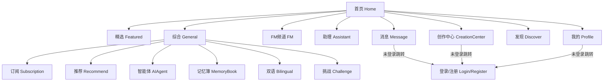
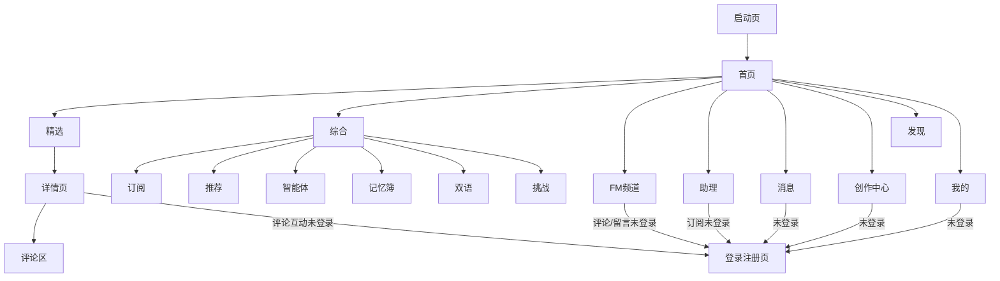
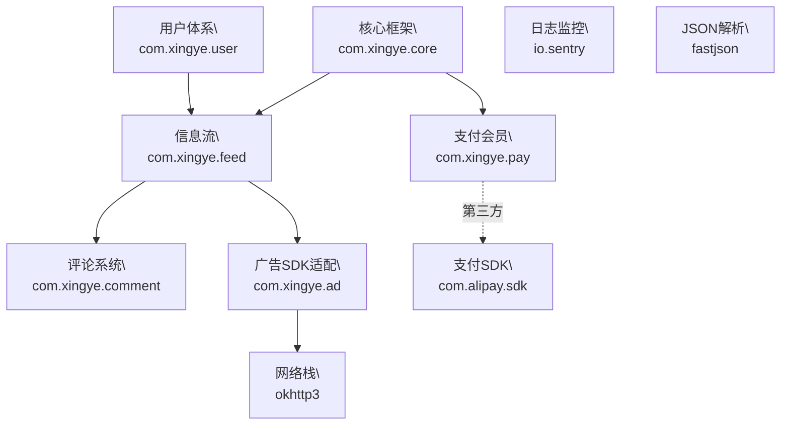

# 星趣app 信息架构文档

---

## 信息架构+线框稿（布局导航、内容层级）

### 一、整体信息架构

// ===================== 功能模块总览（中英文映射表） =====================
| 中文模块名   | 英文组件名         | 说明                   |
| ------------ | ------------------ | ---------------------- |
| 首页         | Home               | 信息流、精选、综合、FM、助理   |
| 精选         | Featured           | 精选内容流             |
| 综合         | General            | 包含订阅、推荐、智能体、记忆簿、双语、挑战 |
| 订阅         | Subscription       | 订阅内容               |
| 推荐         | Recommend          | 推荐内容               |
| 智能体       | AIAgent            | 智能体相关             |
| 记忆簿       | MemoryBook         | 记忆簿                 |
| 双语         | Bilingual          | 双语内容               |
| 挑战         | Challenge          | 挑战活动               |
| FM频道       | FM                 | 音频内容               |
| 助理         | Assistant          | 智能助理               |
| 消息         | Message            | 聊天、通知、系统消息   |
| 创作中心     | CreationCenter     | 发布、管理内容         |
| 发现         | Discover           | 热门、话题、榜单等     |
| 我的         | Profile            | 个人主页、设置、资产   |
| 登录/注册    | Login/Register     | 认证入口               |
| WebView      | WebView            | H5/支付/外链           |
| 支付结果页   | PaymentResult      | 支付完成反馈           |

// ===================== 模块依赖Block图（Mermaid） =====================


// ===================== 访问权限与交互逻辑说明 =====================
> **访问权限说明：**  
> "我的"、"消息"、"创作中心"三个主Tab模块，需用户注册并登录后方可访问。未登录用户点击上述Tab时，系统将自动跳转至"登录/注册"页面，完成认证后才可进入对应功能模块。此机制保障了用户数据安全与个性化服务体验。

| Tab模块      | 英文组件名       | 未登录访问行为         | 登录后访问行为         |
|--------------|------------------|------------------------|------------------------|
| 首页         | Home             | 正常访问               | 正常访问               |
| 消息         | Message          | 跳转至登录/注册        | 进入消息页面           |
| 创作中心     | CreationCenter   | 跳转至登录/注册        | 进入创作中心           |
| 发现         | Discover         | 正常访问               | 正常访问               |
| 我的         | Profile          | 跳转至登录/注册        | 进入个人主页           |

// ===================== 首页分层结构与模块明细 =====================
- 启动页（Splash）
  └─ 首页（Home）
      ├─ 精选（Featured）
      │   └─ 详情页（FeedDetail）
      │       └─ 评论列表（CommentList）
      ├─ 综合（General）
      │   ├─ 订阅（Subscription）
      │   ├─ 推荐（Recommend）
      │   ├─ 智能体（AIAgent）
      │   ├─ 记忆簿（MemoryBook）
      │   ├─ 双语（Bilingual）
      │   └─ 挑战（Challenge）
      ├─ FM频道（FM）
      ├─ 助理（Assistant）
      ├─ 消息（Message）
      ├─ 发现（Discover）
      └─ 我的（Profile）
  └─ WebView（H5/支付/外链）
      └─ 支付结果页（PaymentResult）

### 二、页面层级与导航关系

// ===================== 首页模块交互与跳转逻辑 =====================

> 本节重点梳理首页及其子模块（精选、综合、FM、助理）交互跳转逻辑，结合产品交互文档与高阶分析报告，确保描述具体、完整、标准化。

#### 1. 首页默认展示与精选页交互
- 用户打开App，默认进入首页"精选"页面。
- 精选页顶部为角色列表，点击角色右侧**加号**或**汉堡icon**，未登录弹出注册/登录页。
- 点击**消息icon**跳转评论区，自动弹出最新评论，评论区有返回按钮。
- 精选页底部输入框支持语音/文本输入，右侧有**灯泡icon**（默认回复列表）、**加号icon**（弹出功能icon组：重启、语音通话、图片、链接、小红书、举报），再次点击变为**乘号icon**恢复初始状态。
- 交互流程标准化，所有未登录用户涉及互动、评论、订阅等操作均弹出注册/登录页。

#### 2. 综合页六大子页面交互
- 综合页含订阅、推荐、智能体、记忆簿、双语、挑战六大子页。
- 订阅页：未订阅时为空。
- 推荐页：可选择角色聊天。
- 智能体页：右侧下拉箭头弹出性别选择，底部有取消/确认按钮。
- 记忆簿页：卡片列表，点击卡片查看历史聊天。
- 双语页：可选不同语言助手。
- 挑战页：列表卡片，点击互动。

#### 3. FM频道交互
- 支持单曲/列表循环、上一曲/下一曲、播放/暂停。
- 可点赞、收藏、查看评论，评论区为半屏弹窗，支持图片、置顶。
- 未登录用户点击评论输入框弹出注册/登录页。
- 评论可点赞、留言，未登录留言同样弹出注册/登录页。
- 评论区右上角**乘号icon**返回FM主页面。
- 可切换播客内容、查看文本、关注播客。

#### 4. 助理页交互
- 助理为专属AI助手，支持语音/文本聊天。
- 点击**加号icon**可订阅助理，选择后与其交互。
- 助理显示消息数、内容统计。
- 右上角**扬声器icon**切换自动播放语音。
- 导航最右侧**搜索控件**进入搜索页。

#### 5. 搜索页交互
- 顶部为搜索框，支持文本输入。
- 默认推荐猜你想搜内容。
- 榜单为列表，含星光榜、钻石榜，右侧有"更多"按钮展开更多角色。
- 右上角"取消"按钮返回首页精选页。

#### 6. 首页Tab与全局跳转逻辑
- 底部Tab栏含：首页、消息、创作中心、发现、我的。
- 未登录用户点击"消息""创作中心""我的"均弹出注册/登录页。
- 登录后可访问对应Tab内容。
- 首页各子模块间支持Tab切换，内容无刷新切换。

// ===================== 首页页面跳转链路（标准化流程链） =====================



// ===================== 交互流程补充说明（结合高阶分析报告） =====================
> 1. App 启动后经 Splash → 首页，首页分为精选、综合、FM、助理四大区块，均可Tab切换。
> 2. 精选/综合/推荐等内容流页面，点击角色、评论、分享、举报等均有标准化跳转链路，未登录用户所有互动均需先注册/登录。
> 3. 详情页、评论区、FM、助理等页面均支持返回上一级，所有弹窗/模态均有关闭逻辑。
> 4. 首页Tab与全局Tab栏跳转链路与高阶报告Intent链一致，支持WebView外链、支付回调等。
> 5. Deep-Link与外部分享入口均可直达内容详情、支付结果等页面。

// ===================== 顶部/主体/底部/弹窗导航结构简述 =====================
- 顶部导航：状态栏（时间、WiFi、音量、通知数）
- 主体区：内容模块（Feed流/卡片网格/智能体/挑战/记忆簿等）
- 底部Tab栏：5大主入口（首页、消息、创作中心、发现、我的），中央创作中心icon支持登录/注册
- 侧边/弹窗：分享、举报、编辑、管理、批量操作等
// 以上结构与交互流程均与高阶产品分析报告保持一致，便于团队协作与产品落地。

### 三、典型线框稿

// ===================== 说明 =====================
> 本章节将参考设计文档"APP应用场景"各页面描述，结合信息架构视角，绘制每个页面的线框稿。所有内容均为结构化线框示意与要素分布，不照搬设计文档原文，仅提炼核心结构与交互要素，便于产品、设计、开发协作。

---

#### 3.1 首页-精选页

// 线框结构示意
```
+------------------------------------------------------+
| 状态栏 | 通知 | WiFi | FM入口 | 搜索 | 小红书分享 |
+------------------------------------------------------+
| 角色头像 | 昵称 | 连接数 | 消息数 | 关注按钮      |
+------------------------------------------------------+
| AI图片 | 角色简介 | 特征标签 | 对话气泡         |
+------------------------------------------------------+
| 输入框 | 语音/文本 | 格式化 | 功能扩展 | 快捷回复   |
+------------------------------------------------------+
| Tab栏：首页/消息/创作/发现/我的 | 小红书分享入口   |
+------------------------------------------------------+
```
// 结构要素分布
- 顶部：状态栏、通知、FM、搜索、小红书
- 角色区：头像、昵称、连接数、消息数、关注
- 主体：AI图片、简介、标签、对话
- 控制区：输入、语音/文本、格式化、功能扩展、快捷回复
- 底部：Tab栏、分享
// 主要交互说明
- 角色卡片点击查看详情/关注/评论/分享
- 输入区支持语音/文本切换、快捷回复
- Tab切换主功能模块
- 未登录交互弹注册/登录

---

#### 3.2 首页-综合-订阅页

// 线框结构示意
```
+------------------------------------------------------+
| 状态栏 | 通知 | WiFi | FM入口 | 角色设计 | 高亮 |
+------------------------------------------------------+
| 频道卡片 | 下拉选择 | 快捷入口 | 小红书分享         |
+------------------------------------------------------+
| 订阅频道列表（卡片/分组）                           |
+------------------------------------------------------+
| Tab栏 | 小红书分享入口                              |
+------------------------------------------------------+
```
// 结构要素分布
- 顶部：状态栏、通知、FM、角色设计、高亮
- 频道区：频道卡片、下拉、快捷入口、分享
- 主体：订阅频道列表
- 底部：Tab栏、分享
// 主要交互说明
- 频道卡片点击查看详情/管理
- 下拉选择切换频道分组
- Tab切换主功能模块
- 未登录交互弹注册/登录

---

#### 3.3 首页-综合-推荐页

// 线框结构示意
```
+------------------------------------------------------+
| 状态栏 | 通知 | WiFi | FM入口 | 搜索 | 高亮 |
+------------------------------------------------------+
| 推荐Tab高亮 | 角色设计 | Xray分析 | 小红书分享       |
+------------------------------------------------------+
| 2列2行网格：角色卡片（头像/昵称/分数/连接数）      |
+------------------------------------------------------+
| 推荐统计 | Tab栏 | 小红书分享入口                  |
+------------------------------------------------------+
```
// 结构要素分布
- 顶部：状态栏、通知、FM、搜索、高亮
- 功能区：Tab高亮、角色设计、Xray、小红书
- 主体：角色网格卡片
- 底部：统计、Tab栏、分享
// 主要交互说明
- 角色卡片点击查看详情/关注/评论/分享
- Tab切换主功能模块
- 高亮/角色设计/Xray分析入口
- 未登录交互弹注册/登录

---

#### 3.4 首页-综合-智能体页

// 线框结构示意
```
+------------------------------------------------------+
| 状态栏 | 通知 | WiFi | FM入口 | 音频 | 小红书 |
+------------------------------------------------------+
| 智能体分组统计 | 分组卡片 | 图片/相册 | 主页设计 |
+------------------------------------------------------+
| 智能体列表（卡片/分组/统计/快捷入口）               |
+------------------------------------------------------+
| Tab栏 | 小红书分享入口                              |
+------------------------------------------------------+
```
// 结构要素分布
- 顶部：状态栏、通知、FM、音频、小红书
- 分组区：分组统计、卡片、图片、主页设计
- 主体：智能体列表
- 底部：Tab栏、分享
// 主要交互说明
- 分组卡片点击查看详情/管理
- 图片/主页设计入口
- Tab切换主功能模块
- 未登录交互弹注册/登录

---

#### 3.5 首页-综合-记忆簿页

// 线框结构示意
```
+------------------------------------------------------+
| 状态栏 | 通知 | WiFi | FM入口 | 音频 | 小红书 |
+------------------------------------------------------+
| 记忆分组统计 | 分组卡片 | 系统/AI/国际化/帮助等     |
+------------------------------------------------------+
| 记忆条目列表（分组/标签/快捷入口/主题切换）         |
+------------------------------------------------------+
| Tab栏 | 小红书分享入口                              |
+------------------------------------------------------+
```
// 结构要素分布
- 顶部：状态栏、通知、FM、音频、小红书
- 分组区：分组统计、卡片、系统/AI/国际化/帮助
- 主体：记忆条目列表、主题切换
- 底部：Tab栏、分享
// 主要交互说明
- 分组卡片/条目点击查看详情/管理
- 主题切换/系统/AI/国际化/帮助入口
- Tab切换主功能模块
- 未登录交互弹注册/登录

---

#### 3.6 首页-综合-双语页

// 线框结构示意
```
+------------------------------------------------------+
| 状态栏 | 通知 | WiFi | FM入口 | 音频 | 小红书 |
+------------------------------------------------------+
| 左/右统计 | 分组 | 标签 | 小红书分享                |
+------------------------------------------------------+
| 双语内容列表 | 文本输入 | 格式化 | 系统相关 | 新建 |
+------------------------------------------------------+
| Tab栏 | 小红书分享入口                              |
+------------------------------------------------------+
```
// 结构要素分布
- 顶部：状态栏、通知、FM、音频、小红书
- 统计区：左/右统计、分组、标签、分享
- 主体：双语内容列表、文本输入、格式化、系统相关、新建
- 底部：Tab栏、分享
// 主要交互说明
- 内容卡片点击查看详情/切换语言/新建
- 文本输入/格式化/系统相关入口
- Tab切换主功能模块
- 未登录交互弹注册/登录

---

#### 3.7 首页-综合-挑战页

// 线框结构示意
```
+------------------------------------------------------+
| 状态栏 | 通知 | WiFi | FM入口 | 音频 | 小红书 |
+------------------------------------------------------+
| 挑战统计 | 分组统计 | 图片/头像 | 小红书分享         |
+------------------------------------------------------+
| 挑战任务列表（分组/标签/快捷入口/新建/图片）         |
+------------------------------------------------------+
| Tab栏 | 小红书分享入口                              |
+------------------------------------------------------+
```
// 结构要素分布
- 顶部：状态栏、通知、FM、音频、小红书
- 统计区：挑战统计、分组统计、图片/头像、分享
- 主体：挑战任务列表、分组、标签、快捷入口、新建、图片
- 底部：Tab栏、分享
// 主要交互说明
- 挑战卡片点击查看详情/参与/切换分组/新建
- Tab切换主功能模块
- 未登录交互弹注册/登录

---

#### 3.8 首页-FM频道

// 线框结构示意
```
+------------------------------------------------------+
| 状态栏 | 通知 | WiFi | 播放控制 | 搜索 | 小红书 |
+------------------------------------------------------+
| 播客角色大图 | 播放进度 | 单曲/列表循环 | 上/下一曲 |
+------------------------------------------------------+
| 播客文本 | 评论icon | 点赞 | 收藏 | 关注 |
+------------------------------------------------------+
| 评论区（半屏弹窗/置顶/图片/输入框）                 |
+------------------------------------------------------+
| Tab栏 | 小红书分享入口                              |
+------------------------------------------------------+
```
// 结构要素分布
- 顶部：状态栏、通知、播放控制、搜索、小红书
- 主体：播客角色大图、进度、循环、切歌
- 控制区：文本、评论、点赞、收藏、关注
- 评论区：半屏弹窗、置顶、图片、输入
- 底部：Tab栏、分享
// 主要交互说明
- 播放控制支持单曲/列表循环、切歌、暂停/播放
- 评论icon弹出评论区，支持图片、置顶、输入
- 点赞、收藏、关注播客
- Tab切换主功能模块
- 未登录评论/留言弹注册/登录

---

#### 3.9 首页-助理页

// 线框结构示意
```
+------------------------------------------------------+
| 状态栏 | 通知 | WiFi | 扬声器icon | 搜索 | 小红书 |
+------------------------------------------------------+
| 助理头像 | 名称 | 消息数 | 内容统计 | 订阅按钮 |
+------------------------------------------------------+
| 聊天区（语音/文本输入、消息气泡、快捷回复）         |
+------------------------------------------------------+
| 订阅/设置/自动播放语音/内容统计等功能入口           |
+------------------------------------------------------+
| Tab栏 | 小红书分享入口                              |
+------------------------------------------------------+
```
// 结构要素分布
- 顶部：状态栏、通知、扬声器、搜索、小红书
- 助理区：头像、名称、消息数、统计、订阅
- 聊天区：语音/文本输入、消息气泡、快捷回复
- 功能区：订阅、设置、自动播放、统计
- 底部：Tab栏、分享
// 主要交互说明
- 助理支持语音/文本聊天、快捷回复
- 订阅按钮订阅助理，未登录弹注册/登录
- 扬声器icon切换自动播放语音
- 搜索入口进入搜索页
- Tab切换主功能模块

---

#### 3.10 首页-搜索页

// 线框结构示意
```
+------------------------------------------------------+
| 状态栏 | 通知 | WiFi | 搜索框 | 取消按钮 |
+------------------------------------------------------+
| 猜你想搜 | 推荐榜单（星光榜/钻石榜/列表）           |
+------------------------------------------------------+
| 榜单行：序号 | 头像 | 角色名 | ID | 星钻数 | icon |
+------------------------------------------------------+
| 更多按钮（展开更多角色）                            |
+------------------------------------------------------+
| Tab栏 | 返回精选页                                 |
+------------------------------------------------------+
```
// 结构要素分布
- 顶部：状态栏、通知、搜索框、取消
- 主体：猜你想搜、推荐榜单、列表
- 榜单行：序号、头像、角色名、ID、星钻数、icon
- 更多按钮展开更多角色
- 底部：Tab栏、返回精选页
// 主要交互说明
- 搜索框支持文本输入，右上角取消返回精选页
- 榜单支持展开、角色详情、互动
- Tab切换主功能模块

---

#### 3.11 消息页（Message Tab）

// 线框结构示意
```
+------------------------------------------------------+
| Tab栏点击"消息"icon（游客状态）                    |
+------------------------------------------------------+
| 弹出注册/登录页                                     |
+------------------------------------------------------+
```
// 结构要素分布
- 仅有Tab栏"消息"icon，点击后弹注册/登录页
// 主要交互说明
- 游客点击"消息"Tab，无法访问消息内容，强制弹出注册/登录页

---

#### 3.12 创作中心页（CreationCenter Tab）

// 线框结构示意
```
+------------------------------------------------------+
| Tab栏点击"创作中心"icon（游客状态）                |
+------------------------------------------------------+
| 弹出注册/登录页                                     |
+------------------------------------------------------+
```
// 结构要素分布
- 仅有Tab栏"创作中心"icon，点击后弹注册/登录页
// 主要交互说明
- 游客点击"创作中心"Tab，无法访问创作内容，强制弹出注册/登录页

---

#### 3.13 我的页（Profile Tab）

// 线框结构示意
```
+------------------------------------------------------+
| Tab栏点击"我的"icon（游客状态）                    |
+------------------------------------------------------+
| 弹出注册/登录页                                     |
+------------------------------------------------------+
```
// 结构要素分布
- 仅有Tab栏"我的"icon，点击后弹注册/登录页
// 主要交互说明
- 游客点击"我的"Tab，无法访问个人主页，强制弹出注册/登录页

---

#### 3.14 发现页（Discover Tab）

// 线框结构示意
```
+------------------------------------------------------+
| 状态栏 | 时间 | WiFi | 网络 | 蓝牙 | 电量           |
+------------------------------------------------------+
| 搜索栏（放大镜icon + 关键词"时代少年团"）           |
+------------------------------------------------------+
| [钻石榜] 头像x3 → | [星野市集 Beta] 购物袋icon →   |
+------------------------------------------------------+
| 分类导航栏：精选🔥 | FM专栏New | 同人 | 趣味 | 工具   |
+------------------------------------------------------+
| 星野智能体周边首发区（大Banner/徽章/动漫角色/箭头） |
+------------------------------------------------------+
| #顶流剧本创作周 > | 参与人数 | 描述文字              |
| 角色卡片x3（头像+名字）                             |
+------------------------------------------------------+
| FM古人电台 >（闪电icon）                            |
| 古画风图片+标题+简介+作者                           |
+------------------------------------------------------+
| Tab栏：首页 | 消息 | + | 发现 | 我的                |
+------------------------------------------------------+
```
// 结构要素分布
- 顶部区域：状态栏（时间、WiFi、网络、蓝牙、电量）、搜索栏（放大镜icon+关键词）
- 中部核心功能区：
  - 钻石榜（钻石icon、榜单名、3头像、右箭头）
  - 星野市集（购物袋icon、Beta、说明、右箭头）
  - 分类导航栏（精选🔥、FM专栏New、同人、趣味、工具等Tab）
  - 星野智能体周边首发区（大Banner、动漫角色徽章、首发限定、箭头/图标）
  - 顶流剧本创作周区（王冠icon、标题、参与人数、描述、3角色卡片）
  - FM古人电台区（闪电icon、标题、古画风图片、简介、作者）
- 底部区域：固定导航栏（首页、消息、+、发现、我的）

// 主要交互说明
- 搜索栏支持点击输入/跳转搜索页
- 钻石榜、星野市集、Banner、角色卡片、FM电台等均可点击进入详情或更多内容
- 分类导航栏Tab切换不同内容板块
- Banner区左右箭头支持翻页或查看更多
- 角色卡片点击查看角色详情
- FM电台点击播放/进入详情
- 底部Tab栏切换主功能模块，"+"号按钮支持内容添加/创作
- 游客点击"消息""创作中心""我的"Tab弹注册/登录页

---

### 四、内容层级与复用
- 组件复用率高，典型如item_feed、item_comment、dialog_common、activity_base、include_toolbar等
- 布局平均嵌套5-7层，部分深层页面建议用ConstraintLayout或Compose优化
- 交互流程以Intent链为主，支持Deep-Link、H5外链 

// ===================== 系统技术架构与依赖关系 =====================

#### 1. 技术核心模块总览

| 技术模块中文名   | 英文/包名                | 主要作用说明                   |
|------------------|--------------------------|-------------------------------|
| 核心框架         | com.xingye.core          | 应用基础能力、全局调度         |
| 信息流           | com.xingye.feed          | 首页Feed流、精选、推荐         |
| 评论系统         | com.xingye.comment       | 评论、回复、互动               |
| 用户体系         | com.xingye.user          | 账号、登录、用户信息           |
| 广告SDK适配      | com.xingye.ad            | 广告展示、SDK对接              |
| 支付会员         | com.xingye.pay           | 会员支付、订单                 |
| 日志监控         | io.sentry                | 崩溃、异常、埋点监控           |
| 网络栈           | okhttp3                  | 网络请求、数据通信             |
| JSON解析         | fastjson                 | 数据序列化/反序列化            |
| 支付SDK          | com.alipay.sdk           | 第三方支付                     |

// ===================== 技术依赖关系图（Mermaid） =====================


// ===================== 业务-技术映射说明 =====================
> 说明：本节为高阶技术架构，主要描述App各业务模块与核心技术组件的依赖关系。便于研发、测试、运维等团队理解系统分层与耦合点。
> 业务-技术映射有助于定位问题、优化性能、规划扩展。

- 首页/精选/推荐/综合等页面，主要依赖：**信息流（com.xingye.feed）**、**评论系统（com.xingye.comment）**、**广告SDK（com.xingye.ad）**、**用户体系（com.xingye.user）**。
- 会员、支付相关页面，依赖：**支付会员（com.xingye.pay）**、**支付SDK（com.alipay.sdk）**。
- 所有页面均依赖：**核心框架（com.xingye.core）**、**网络栈（okhttp3）**、**JSON解析（fastjson）**、**日志监控（io.sentry）**。 